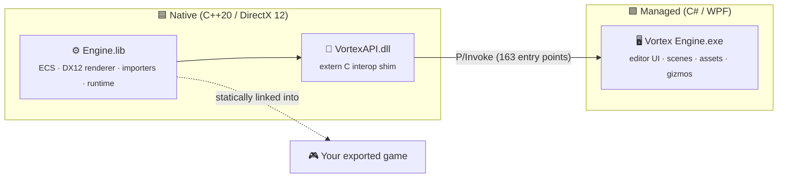

<div align="center">

# 🌀 Vortex Engine

### A modern, lightweight game engine — native **DirectX 12** core, clean **WPF** editor.

<br/>

[](../../actions)
[](#-getting-started)
[](#-architecture)
[](#-architecture)
[](#-architecture)
[](#-roadmap)

<br/>

**Build worlds. Import anything. Press ▶ Play.**

A two-part engine: a fast native **runtime** that compiles straight into your shipped games, and a separate **editor** for authoring scenes, assets and gameplay — wired together through a single thin C interop layer.

[Getting Started](#-getting-started) · [Architecture](#-architecture) · [Features](#-features) · [Roadmap](#-roadmap)

</div>

---

## ✨ Highlights

| | |
|---|---|
| 🎨 **DirectX 12 renderer** | Forward PBR pipeline, dynamic lights (directional · point · spot), procedural skybox, editor grid & gizmos, wireframe and VSync toggles. |
| 🧩 **Entity Component System** | Data-oriented entities with Transform, MeshRenderer, Camera and Skybox components — the same model in the editor and the runtime. |
| 📦 **Import anything** | Models via **Assimp** (FBX, OBJ, glTF, …), textures via **stb_image**, full PBR materials (albedo · normal · metallic · roughness · AO · emissive). |
| 🌍 **World building** | Scene hierarchy, **prefabs** (save entities as `.ventity` assets, instantiate, Apply/Revert), always-on-top transform gizmos, multi-viewport editing, drag-&-drop asset placement, and full **Undo/Redo**. |
| ⚡ **DLSS 4** | NVIDIA **Super-Resolution + Frame Generation** (x2/x3/x4) via Streamline, plus a universal render-scale fallback — with a Real/Shown FPS readout. |
| 🔥 **Live hot-reload** | Edit a gameplay **script** or a **custom `.hlsl` shader** in Visual Studio, Alt-Tab back to the editor/game, and the change is in — live in the viewport, the external window, and Debug builds. |
| 🕹️ **Input** | Unified keyboard, mouse and gamepad layer with cursor lock — ready for first/third-person controllers. |
| 🚀 **Ships with your game** | The engine is a static library; your exported game links it directly. Export a packed **Release** build or a source-linked **Debug** build with hot-reload. |

---

## 🏗️ Architecture

Vortex is intentionally split into **three layers** so the heavy native engine can be reused both by the editor *and* by every game you export:



| Layer | Project | Output | Role |
|-------|---------|--------|------|
| **Engine** | `Engine/` | `Engine.lib` | Core runtime: ECS, DX12 renderer, asset importers, scene/resource managers. Links into shipped games. |
| **Interop** | `VortexAPI/` | `VortexAPI.dll` | A thin `extern "C"` bridge (`EDITOR_INTERFACE`) exposing the engine to the editor. |
| **Editor** | `Editor/` | `Vortex Engine.exe` | WPF authoring tool: viewports, inspector, hierarchy, asset browser, material/texture editors. |

> The editor loads `VortexAPI.dll` at runtime from the shared `x64/Release/` output folder — build the solution once and everything is co-located and ready to run.

---

## 🚀 Getting Started

### Prerequisites

- **Windows 10/11 (x64)**
- **Visual Studio 2022/2026** with:
  - *Desktop development with **C++*** (MSVC v143/v145 + Windows 10/11 SDK)
  - *.NET desktop development* (.NET Framework 4.8 targeting pack)

### Build & Run

```bash
# 1. Clone
git clone https://github.com/shadow-kernel/Vortex-Engine.git
cd Vortex-Engine

# 2. Restore native + managed NuGet packages
nuget restore Engine/packages.config    -SolutionDirectory .
nuget restore VortexAPI/packages.config -SolutionDirectory .
nuget restore Editor/packages.config    -SolutionDirectory .

# 3. Build the whole solution (Engine → VortexAPI.dll → Editor)
msbuild Vortex.slnx /t:Build /p:Configuration=Release /p:Platform=x64

# 4. Launch the editor
"x64/Release/Vortex Engine.exe"
```

> 💡 Or just open `Vortex.slnx` in Visual Studio, set the configuration to **Release | x64**, and press **F5**.

---

## 🧩 Features

<details open>
<summary><b>🎨 Rendering</b></summary>

- DirectX 12 forward renderer with a physically-based shading model
- GPU instancing, geometric LOD + multi-threaded frustum culling for large scenes
- **NVIDIA DLSS 4** Super-Resolution + Frame Generation (x2/x3/x4) + a universal render-scale slider
- **Custom per-material `.hlsl` shaders** — live in the scene and every material preview, with hot-reload
- Directional, point and spot lights (with ambient control) + procedural skybox
- Always-on-top transform/rotation/scale gizmos + selection outline
- Wireframe mode, VSync, live Real/Shown FPS · draw-call · vertex stats
</details>

<details>
<summary><b>🔥 Iteration & shipping</b></summary>

- **Live hot-reload** of gameplay scripts + shaders — edit in VS, Alt-Tab back, changes are in (viewport play, external window, and Debug builds)
- **Build Game** dialog: a packed, obfuscated **Release** build, or a source-linked **Debug** build that references your original project so hot-reload edits the same files
</details>

<details>
<summary><b>🧱 Scenes & Entities</b></summary>

- Entity Component System (Transform, MeshRenderer, Camera, Skybox)
- Scene hierarchy with parenting, prefabs, and clipboard
- Full multi-step Undo/Redo across the whole editor
- Multi-viewport editing with per-camera previews
</details>

<details>
<summary><b>📦 Assets</b></summary>

- Model import via Assimp (FBX · OBJ · glTF · and more) → `.vmesh`
- Texture import via stb_image with naming-convention detection
- PBR material editor (albedo · normal · metallic · roughness · AO · emissive)
- Asset browser, file explorer, GUID metadata & dependency tracking
</details>

<details>
<summary><b>🕹️ Input</b></summary>

- Keyboard, mouse and gamepad state with press/hold/release queries
- Mouse delta + scroll, cursor lock & visibility — controller-ready
</details>

---

## 🗺️ Roadmap

We're building toward a complete, **Apple-clean** engine you can ship a **16-player Battle Royale** with.

| Status | Milestone |
|:------:|-----------|
| ✅ | **One coherent codebase** — single `main`, one solution that builds Engine → VortexAPI.dll → Editor green |
| ✅ | Verified native+managed build & CI with deployment checks |
| ✅ | **▶ Play in editor** — native engine tick loop, physics + gameplay scripts |
| ✅ | **Play in a separate window** — native `GameHost` window, uncapped FPS |
| ✅ | **Asset persistence & export** — `.vmesh`/`.vmat`, standalone Player, **Build Game** dialog (Debug/Release) |
| ✅ | **DLSS 4** Super-Resolution + Frame Generation (x2/x3/x4) + render-scale fallback |
| ✅ | **Live hot-reload** — scripts + custom `.hlsl` shaders, in every play context, from the same source |
| ✅ | **Custom per-material shaders** — render live in the scene **and** all previews, with hot-reload |
| ✅ | **Prefabs** — save entities as `.ventity`, instantiate linked copies, Apply/Revert |
| ✅ | **Modern editor UI** — always-on-top gizmos, live material previews, 2D UI (VUI), Locate, Source Control |
| 🔜 | **Mouse + keyboard character controller** (first/third person) |
| 🔜 | **Battle Royale framework** — health, weapons, inventory, spawn, shrinking zone, HUD |
| 🔜 | **Networking** — client-server replication for up to **16 players** |

> Gameplay (health, weapons, controllers, …) lives in **project scripts** (`VortexBehaviour`), never hardcoded in the engine. See the live task board in-repo for the granular breakdown.

---

## 📂 Project Structure

```
Vortex-Engine/
├─ Engine/        🟦 C++ DX12 engine (static lib)
│  ├─ Components/   ECS components
│  ├─ Graphics/     DX12 backend, importers, resources, geometry
│  ├─ Runtime/      scene/resource/prefab managers, systems
│  └─ Input/        input system
├─ VortexAPI/     🔌 C interop DLL (extern "C" bridge)
├─ Editor/        🟪 C# WPF editor
│  ├─ ECS/          managed entity/component model
│  ├─ Core/         services, assets, serialization, undo/redo
│  ├─ DllWrapper/   P/Invoke layer onto VortexAPI.dll
│  └─ Editors/      WorldEditor UI (viewports, inspector, hierarchy …)
├─ EngineTest/    🧪 native ECS test harness
└─ Installer/      📦 Inno Setup packaging
```

---

<div align="center">

### 🌀 Built with passion. Powered by DirectX 12.

<sub>Vortex Engine is in active alpha development — expect rapid change.</sub>

</div>
