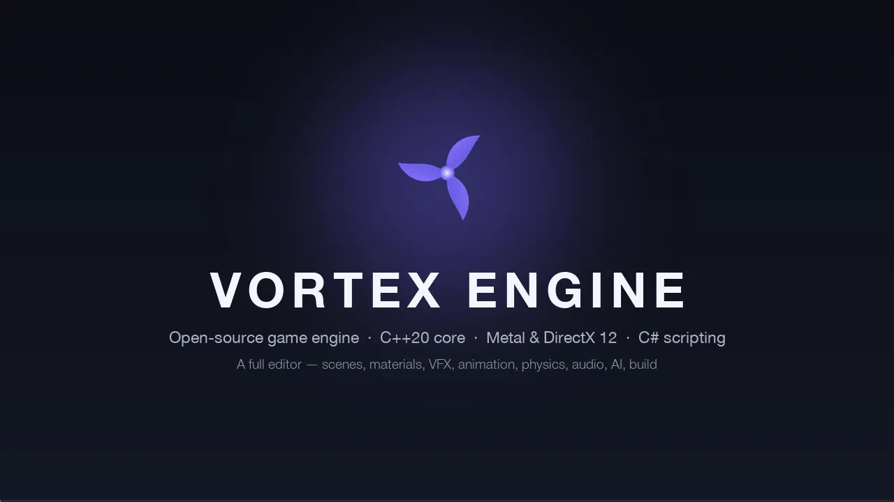
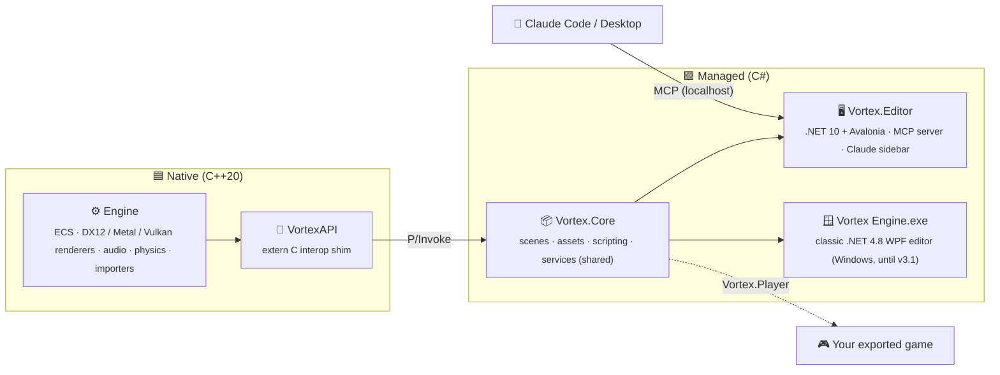
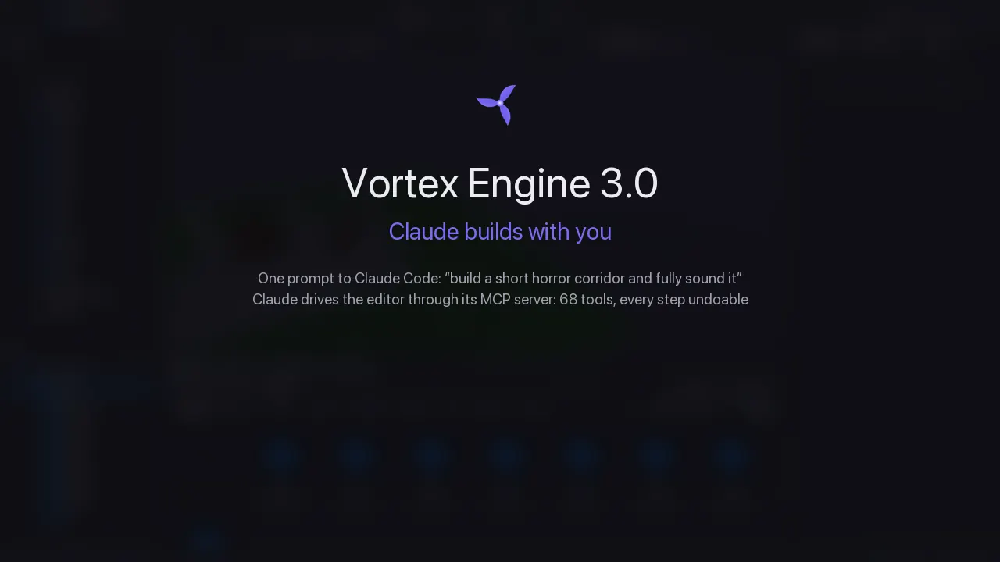

<div align="center">


# Vortex Engine

### A modern, lightweight game engine — native **DirectX 12 · Metal · Vulkan** core, a cross-platform editor, and **Claude** built in.

### 🌐 **[engine.vortexstudio.dev](https://engine.vortexstudio.dev)**

<br/>

[](../../actions)
[](#-getting-started)
[](#-architecture)
[](#-architecture)
[](#-architecture)
[](https://engine.vortexstudio.dev/docs/#/claude)
[](#-roadmap)
[](LICENSE)
[](#-license)

<br/>



<sub><b>Vortex in 30 seconds</b> — scene editor · play in the editor · the <a href="https://github.com/shadow-kernel/Vortex-Engine-Tactical-Template">Tactical Shooter</a> template · VFX, animation, material, model, prefab, collision, audio, build and Git tools (recorded on macOS)</sub>

<br/><br/>

**Build worlds. Import anything. Press ▶ Play.**

**Free and open source (MIT) — free to use for anything, including commercial games.** A two-part engine: a fast native **runtime** that compiles straight into your shipped games, and a separate **editor** for authoring scenes, assets and gameplay — wired together through a single thin C interop layer. Contributions welcome. 🌀

[Getting Started](#-getting-started) · [Architecture](#-architecture) · [Features](#-features) · [Roadmap](#-roadmap) · [Contributing](#-contributing) · [License](#-license)

</div>

---

## ✨ Highlights

| | |
|---|---|
| 🤖 **Claude, built in** | The editor runs an **MCP server**: Claude Code or Claude Desktop builds scenes, materials, shaders, scripts, sound and whole worlds through 68 tools, play-tests and looks at the result — every change one undo step, with dry runs and an operations log. Or work with Claude in the editor's own **Claude sidebar**: Ask or Agent, your choice of model, effort and context. |
| 🖥️ **Windows · macOS · Linux** | **Direct3D 12**, **Metal** and **Vulkan** renderers; one .NET 10 editor with the same UI on all three; games build for all three from any of them. |
| 🎨 **Renderer** | Physically-based shading, shadow maps for directional, point and spot lights, height fog, SSAO, bloom, vignette, film grain, colour grading, custom per-material shaders, GPU instancing + LOD, **DLSS 4** on NVIDIA. |
| 🔊 **Audio** | 3D sound sources, sound containers with variation, reverb zones, a mixer with buses, ducking and meters — and the **Sound Studio**, which generates sounds from a description. |
| 📚 **Asset library & store** | Every asset on your machine in one deduplicated library shared by all projects, and an in-editor **Asset Store** (Poly Haven, ambientCG, Kenney, Freesound, Sketchfab …) that tracks licenses into your build. |
| 🧩 **Scenes & gameplay** | Entities and components, prefabs, full undo/redo; gameplay as C# `VortexBehaviour` scripts with hot reload — triggers, raycasts, coroutines, save slots, UI. Physics and ragdolls on **Jolt** (macOS / Linux; the Visual Studio build follows in v3.1). |
| 🎮 **Templates** | Start from a playable 3D, horror or tactical-shooter project; template content downloads on demand, and games update when their template improves. |
| 🚀 **Ships with your game** | **Build Game** packs a branded Release build (or a hot-reloadable Debug build) for Windows, macOS or Linux, with credits and a license check. |

---

## 🎮 Project Templates

New projects start from a template (the project hub ▸ **Create**). Every template is a complete, playable project, and
all of its gameplay is plain project scripts you can read and change:

| Template | What you get |
|---|---|
| **[3D Starter](https://github.com/shadow-kernel/Vortex-Engine-3D-Template)** | a start screen and a playable first-person mini-world |
| **[Horror Starter](https://github.com/shadow-kernel/Vortex-Engine-Horror-Template)** | a CoD-feel night shooter: an open industrial yard plus a lit brick cellar |
| **[Tactical Shooter](https://github.com/shadow-kernel/Vortex-Engine-Tactical-Template)** | a Call-of-Duty-style gun range: two animated first-person weapons with iron-sight ADS and recoil, pop-up targets, a kill house, and CoD movement (sprint · slide · mantle) |

The templates are git submodules under `Templates/` (clone with `--recurse-submodules`). Their models, textures
and audio live in **Git LFS**. Installed editors don't carry that content: the first project from such a template
downloads the template pack of your Vortex version from the release and keeps it for later projects
([Project Templates](https://engine.vortexstudio.dev/docs/#/templates)). A source checkout uses its own files after
`git lfs install && git submodule foreach 'git lfs pull'`; without LFS it downloads the packs like an installed editor.
Games made from an older template update with **Project Hub ▸ right-click ▸ Update from Template…**.

---

## 🏗️ Architecture

Vortex is intentionally split into **three layers** so the heavy native engine can be reused both by the editors *and* by every game you export:


```mermaid
flowchart LR
    subgraph Native["🟦 Native (C++20)"]
        ENG["⚙️ Engine<br/><sub>ECS · DX12 / Metal / Vulkan renderers · audio · physics · importers</sub>"]
        API["🔌 VortexAPI<br/><sub>extern C interop shim</sub>"]
        ENG --> API
    end
    subgraph Managed["🟪 Managed (C#)"]
        CORE["📦 Vortex.Core<br/><sub>scenes · assets · scripting · services (shared)</sub>"]
        AV["🖥️ Vortex.Editor<br/><sub>.NET 10 + Avalonia · MCP server · Claude sidebar</sub>"]
        WPF["🪟 Vortex Engine.exe<br/><sub>classic .NET 4.8 WPF editor (Windows, until v3.1)</sub>"]
        CORE --> AV
        CORE --> WPF
    end
    API -- "P/Invoke" --> CORE
    CORE -. "Vortex.Player" .-> GAME["🎮 Your exported game"]
    CLAUDE["🤖 Claude Code / Desktop"] -- "MCP (localhost)" --> AV
```

| Layer | Project | Output | Role |
|-------|---------|--------|------|
| **Engine** | `Engine/` | `Engine.lib` / `libVortexEngine` | Core runtime: ECS, renderers (Direct3D 12 on Windows, SDL GPU on Metal and Vulkan), audio, physics, importers. |
| **Interop** | `VortexAPI/` | `VortexAPI.dll` / `.dylib` / `.so` | A thin `extern "C"` bridge (`EDITOR_INTERFACE`) exposing the engine to managed code. |
| **Shared core** | `Editor/` (sources) | in both editors + `Managed/Vortex.Core` | Scenes, components, assets, the scripting runtime and every editor service — compiled for .NET Framework 4.8 and .NET 10. |
| **Editors** | `Managed/Vortex.Editor`, `Editor/` | `Vortex.Editor`, `Vortex Engine.exe` | The editor on every platform (Avalonia, with the MCP server and the Claude sidebar); the classic WPF editor stays on Windows until v3.1. |
| **Player** | `Managed/Vortex.Player` | `Vortex.Player` | The standalone game host: what the cross-platform editor exports for Windows, macOS and Linux (via runtime packs). |

> On Windows the WPF editor loads `VortexAPI.dll` from the shared `x64/Release/` output folder; the .NET 10 tools find the native library next to them, in an app bundle's `Frameworks`, or in the CMake build tree.

---

## 🚀 Getting Started

### Install

- **Windows:** `VortexEngine-Setup-<version>.exe` from the [latest release](../../releases/latest).
- **macOS (Apple Silicon):** `Vortex-Editor-<version>.dmg` from the release (from v3.0; not notarised yet — the first time, right-click ▸ **Open**).
- **Linux:** build from source, see [Linux](#-linux-x64--native-engine-player-and-editor).

Then follow **[Getting Started](https://engine.vortexstudio.dev/docs/#/getting-started)**: a game from the Horror Starter, your first scare and a build in about an hour.

### Build from source — prerequisites

- **Windows 10/11 (x64)** — the engine (DX12) and the editor
- **macOS (Apple Silicon)** — native engine, player and editor, see [macOS](#-macos-apple-silicon--native-engine-player-and-editor) below
- **Linux (x64)** — native engine, player and editor, see [Linux](#-linux-x64--native-engine-player-and-editor) below
- **Visual Studio 2022/2026** with:
  - *Desktop development with **C++*** (MSVC v143/v145 + Windows 10/11 SDK)
  - *.NET desktop development* (.NET Framework 4.8 targeting pack, for the classic editor)
- **.NET 10 SDK** — the editor and the player

### Build & Run

```bash
# 1. Clone WITH submodules AND Git LFS (the NVIDIA Streamline SDK + the project templates are submodules;
#    the templates keep their scenes, models, textures and audio in LFS)
git lfs install
git clone --recurse-submodules https://github.com/shadow-kernel/Vortex-Engine.git
cd Vortex-Engine
# (already cloned without submodules / without LFS? run:)
git submodule update --init --recursive
git submodule foreach 'git lfs pull'

# 2. Restore native + managed NuGet packages
nuget restore Engine/packages.config    -SolutionDirectory .
nuget restore VortexAPI/packages.config -SolutionDirectory .
nuget restore Editor/packages.config    -SolutionDirectory .

# 3. Build the whole solution (Engine → VortexAPI.dll → Editor)
msbuild Vortex.slnx /t:Build /p:Configuration=Release /p:Platform=x64

# 4. Build and launch the editor (it finds the native engine in x64/Release)
dotnet run --project Managed/Vortex.Editor -c Release
```

> 💡 `x64/Release/Vortex Engine.exe` is the classic WPF editor (until v3.1). `tools/windows/stage-editor.ps1` lays the
> editor out the way the installer ships it.

### 🍎 macOS (Apple Silicon) — native engine, player and editor

The engine, the standalone player and a cross-platform editor run natively on macOS (Metal via SDL GPU, .NET 10 +
Avalonia). Plan, status and conventions: [`ROADMAP_MACOS_PORT.md`](ROADMAP_MACOS_PORT.md); the managed projects:
[`Managed/README.md`](Managed/README.md).

```bash
brew install cmake ninja assimp sdl3 dotnet
tools/macos/make-app.sh --install     # builds everything and installs "Vortex Editor.app" into /Applications
open -a "Vortex Editor"               # or double-click it in Launchpad; project.vortex files open with it
```

Developing on the Mac: `tools/macos/dev.sh build && tools/macos/dev.sh editor` (Rider / VS Code / Xcode setups in
[`Managed/README.md`](Managed/README.md)). Games export from the Mac editor for macOS, Windows and Linux with the
project's name, icon and version (File ▸ Build; other platforms via runtime packs, see
[`Managed/README.md`](Managed/README.md#exporting-games-macos-windows-linux)). Not on Metal yet: DLSS / frame
generation (NVIDIA-only). The Windows build (DirectX 12 + WPF editor) is unchanged.

### 🐧 Linux (x64) — native engine, player and editor

The same cross-platform stack as the macOS port, with **Vulkan** instead of Metal: the SDL GPU backend renders
through SPIR-V modules compiled from [`Engine/Shaders/glsl`](Engine/Shaders/glsl) at build time, and the editor is
the same .NET 10 + Avalonia shell.

```bash
# Toolchain (one-time)
sudo pacman -S --needed cmake ninja shaderc sdl3 assimp dotnet-sdk vulkan-icd-loader   # Arch
# Debian/Ubuntu: sudo apt install cmake ninja-build glslc libsdl3-dev libassimp-dev dotnet-sdk-10.0 libvulkan1
# Fedora:        sudo dnf install cmake ninja-build glslc SDL3-devel assimp-devel dotnet-sdk-10.0 vulkan-loader

Scripts/linux-dev.sh --release --editor    # builds the engine + the .NET layer, then starts the editor
```

`dev.sh` wraps the two builds; run them directly if you prefer:

```bash
cmake --preset linux-release && cmake --build --preset linux-release -j$(nproc)
dotnet build Managed/Vortex.Managed.slnx -c Release

Managed/Vortex.Editor/bin/Release/net10.0/Vortex.Editor
Managed/Vortex.Player/bin/Release/net10.0/Vortex.Player --project=Templates/Default3D --scene=Match
```

`ctest --preset linux-release` runs the audio, particle, physics and navigation smoke tests; the windowed render
test is opt-in (`-DVORTEX_RENDER_TESTS=ON`) because it needs a display. A GPU with a Vulkan 1.0 driver is required
(`vulkaninfo --summary` must list your card). Custom per-material shaders are `.glsl` here — one file with a
vertex and a fragment stage, compiled by `glslc` on load and hot-reloaded on save; start from
`Engine/Shaders/glsl/material_template.glsl`, which the editor copies for you. The editor embeds its viewport in
an X11 window, so it runs on X11 and, through XWayland, on Wayland sessions. Not on Vulkan: DLSS / frame
generation (NVIDIA + Windows only; the render-scale fallback works).

## 🧩 Features

<details open>
<summary><b>🤖 Claude</b></summary>



- **MCP server inside the editor** (Streamable HTTP on `127.0.0.1` — only programs on this computer can connect) — hook up Claude Code or Claude Desktop with *Tools ▸ Claude ▸ Connect Claude Code / Desktop…*
- **68 tools**: entities and components, materials and custom shaders (with real compiler errors), scripts (with line-accurate compile errors), prefabs, asset import, world macros (grid, scatter, snap), audio and the mixer, sound generation, play mode, screenshots and the console
- **Safe by design**: every tool call is one undo step, mutating tools take a dry run, the Operations window shows each change (file diffs included) and reverts it — even out of order
- **Claude sidebar** (v3.0.3): Claude next to the scene — Ask or Agent, with your choice of model, effort and context; sign in with your Anthropic account or an API key ([guide](https://engine.vortexstudio.dev/docs/#/claude))
- Guides: [Claude Integration](https://engine.vortexstudio.dev/docs/#/claude) · [Claude Tools](https://engine.vortexstudio.dev/docs/#/claude-tools)
</details>

<details>
<summary><b>🎨 Rendering</b></summary>

- Physically-based forward renderer on **Direct3D 12** (Windows), **Metal** (macOS) and **Vulkan** (Linux)
- Shadow maps for directional, point and spot lights; height fog; SSAO, bloom, vignette, film grain, colour grading, chromatic aberration
- GPU instancing, geometric LOD + multi-threaded frustum culling for large scenes
- **NVIDIA DLSS 4** Super-Resolution + Frame Generation (x2/x3/x4) on Windows + a universal render-scale slider
- **Custom per-material shaders** (`.hlsl` / `.metal` / `.glsl`) — live in the scene and every material preview, with hot-reload
- Always-on-top transform/rotation/scale gizmos + selection outline; wireframe, VSync, live FPS · draw-call · vertex stats
</details>

<details>
<summary><b>🔊 Audio</b></summary>

- 3D audio sources and listener, sound containers (`.vsndc`) with weighted variation and pitch/volume ranges, reverb zones
- Mixer with buses, solo/mute, ducking and meters; music with fades and cross-fades; `Vortex.Audio` scripting API
- **Sound Studio**: describe a sound, audition takes, save the best — procedural offline or ElevenLabs / fal.ai / Stability with your own key
- Guide: [Audio](https://engine.vortexstudio.dev/docs/#/audio-guide)
</details>

<details>
<summary><b>🧱 Scenes, gameplay & physics</b></summary>

- Entities and components, scene hierarchy with parenting, prefabs (Apply/Revert), full multi-step undo/redo
- C# `VortexBehaviour` gameplay scripts with hot reload: input (keyboard, mouse, gamepads incl. DualSense), triggers, raycasts, `Instantiate`/`Destroy`, coroutines, save slots, scene loading, immediate-mode and retained UI
- Collide-and-slide character movement; rigid bodies, joints and ragdolls on **Jolt** (macOS / Linux builds; the Visual Studio build follows in v3.1)
- Skeletal animation with an Animator, IK (two-bone, look-at, foot) and hand poses
- Guides: [Horror Essentials](https://engine.vortexstudio.dev/docs/#/horror-essentials) · [Scripting](https://engine.vortexstudio.dev/docs/#/first-script) · [API reference](https://engine.vortexstudio.dev/docs/#/api-index)
</details>

<details>
<summary><b>📦 Assets</b></summary>

- Model import via Assimp (FBX · OBJ · glTF · and more), textures with naming-convention detection, PBR material editor
- **Asset Library**: every asset on your machine stored once (SHA-256), shared by all projects, with tags and previews — [guide](https://engine.vortexstudio.dev/docs/#/asset-library)
- **Asset Store**: Poly Haven, ambientCG, Kenney, poly.pizza, Freesound, Sketchfab, Mixamo, Sonniss — licenses recorded, credited in builds, checked before shipping — [guide](https://engine.vortexstudio.dev/docs/#/asset-store)
- Asset browser, file explorer, GUID metadata & dependency tracking
</details>

<details>
<summary><b>🔥 Iteration & shipping</b></summary>

- **Live hot-reload** of gameplay scripts + shaders — edit, switch back to the editor, changes are in (viewport play, external window, and Debug builds)
- **Build Game**: a packed, obfuscated **Release** build or a source-linked **Debug** build, for Windows, macOS or Linux from any of them (runtime packs), with your game's name, icon and version, `CREDITS.md` and a license check
- **Project templates** (3D Starter, Horror Starter, Tactical Shooter) with content packs and *Update from Template…*
- CI on every pull request: Windows and macOS builds, native and managed tests, editor smoke checks
</details>

---

## 🗺️ Roadmap

The full roadmap now lives on GitHub: **[Milestones](../../milestones)** (v2.6.0 → v5.0.0) and the **[issue backlog](../../issues)** sorted by `P0`–`P3` priority labels. All documentation — guides, the [feature status](https://engine.vortexstudio.dev/docs/#/feature-status), design notes and how to contribute — is on the **[documentation website](https://engine.vortexstudio.dev/docs/)**.

**The plan in one line:** v2.6 Audio Engine → v2.7 Horror Essentials (*game-dev-ready gate*) → v2.8 Global Asset DB → v2.9 Asset Store + Claude Sound Studio → **v3.0 Claude-Native Engine** → v3.1 Physics v2 (Jolt) → v3.2 AI & Navigation → v3.3 VFX → v3.4 World & Streaming → **v4.0 XXL: 10x-performance GPU-driven renderer**.

We're building toward a complete, **Apple-clean** engine you can ship a **16-player Battle Royale** with — and the first shipped game will be a **first-person horror** title.

| Status | Milestone |
|:------:|-----------|
| ✅ | **One coherent codebase** — single `main`, one solution that builds Engine → VortexAPI.dll → Editor green |
| ✅ | Verified native+managed build & CI with deployment checks |
| ✅ | **▶ Play in editor** — native engine tick loop, physics + gameplay scripts |
| ✅ | **Play in a separate window** — native `GameHost` window, uncapped FPS |
| ✅ | **Asset persistence & export** — `.vmesh`/`.vmat`, standalone Player, **Build Game** dialog (Debug/Release) |
| ✅ | **DLSS 4** Super-Resolution + Frame Generation (x2/x3/x4) + render-scale fallback |
| ✅ | **Live hot-reload** — scripts + custom `.hlsl` shaders, in every play context, from the same source |
| ✅ | **Custom per-material shaders** — render live in the scene **and** all previews, with hot-reload |
| ✅ | **Prefabs** — save entities as `.ventity`, instantiate linked copies, Apply/Revert |
| ✅ | **Modern editor UI** — always-on-top gizmos, live material previews, 2D UI (VUI), Locate, Source Control |
| 🔜 | **Mouse + keyboard character controller** (first/third person) |
| 🔜 | **Battle Royale framework** — health, weapons, inventory, spawn, shrinking zone, HUD |
| 🔜 | **Networking** — client-server replication for up to **16 players** |

> Gameplay (health, weapons, controllers, …) lives in **project scripts** (`VortexBehaviour`), never hardcoded in the engine. See the live task board in-repo for the granular breakdown.

---

## 📂 Project Structure

```
Vortex-Engine/
├─ Engine/        🟦 C++ DX12 engine (static lib)
│  ├─ Components/   ECS components
│  ├─ Graphics/     DX12 backend, importers, resources, geometry
│  ├─ Runtime/      scene/resource/prefab managers, systems
│  └─ Input/        input system
├─ VortexAPI/     🔌 C interop DLL (extern "C" bridge)
├─ Managed/       🟪 .NET 10: Vortex.Core (shared runtime), Vortex.Editor (the editor), Vortex.Player, tests
├─ Editor/        🟪 shared C# sources (+ the classic WPF editor)
│  ├─ ECS/          managed entity/component model
│  ├─ Core/         services, assets, serialization, undo/redo
│  ├─ DllWrapper/   P/Invoke layer onto VortexAPI.dll
│  └─ Editors/      WorldEditor UI (viewports, inspector, hierarchy …)
├─ EngineTest/    🧪 native ECS test harness
└─ Installer/      📦 Inno Setup packaging
```

---

## 🤝 Contributing

Vortex is built in the open and **everyone is welcome** — code, docs, assets, bug
reports, or ideas. Start with **[CONTRIBUTING.md](CONTRIBUTING.md)** for the build
setup and PR flow, and please be excellent to each other per the
**[Code of Conduct](CODE_OF_CONDUCT.md)**.

> One rule to remember: **gameplay lives in project scripts (`VortexBehaviour`), never hardcoded in the engine** — keep the engine generic.

---

## 📄 License

Vortex Engine is **free and open source** under the **[MIT License](LICENSE)**.

**You can use it for anything — including commercial games — free of charge**, with
no royalties and no "made with" requirement. Fork it, ship with it, build a
business on it.

Vortex bundles/links a few permissively-licensed third-party components, and can
optionally use NVIDIA DLSS (proprietary, not bundled). Full details and
attributions are in **[THIRD-PARTY-NOTICES.md](THIRD-PARTY-NOTICES.md)**.

- **Assimp** (BSD-3) · **stb_image** (public domain/MIT) · **AvalonDock** (Ms-PL) · **.NET libs** (MIT)
- **NVIDIA Streamline/DLSS** — optional, NVIDIA-proprietary, fetched at build time, never committed. If you *ship* a DLSS build, NVIDIA's attribution + registration terms apply to you as the distributor.
- **Assets** in the default template: Kenney models (CC0) + author-generated textures.

---

## 💜 Support Vortex — Donate

**Vortex is free forever — MIT-licensed, no royalties, no catch.** It's built in
the open and given away so anyone can make games. If Vortex helps you, a donation
keeps it that way.

**Where it goes:** new engine features · better docs & tutorials · free **CC0
asset packs** for the community · build/CI hosting so releases stay fast and reliable.

**🎯 First goal — €1,000:** a year of build & CI hosting **plus** a free community
asset pack. Every contribution, big or small, gets us there. 🙏

> 💜 **[Sponsor on GitHub »](https://github.com/sponsors/shadow-kernel)**

---

<div align="center">

### 🌀 Built with passion. Powered by DirectX 12 · Metal · Vulkan.

<sub>Vortex Engine is free & open source (MIT) — in active alpha, expect rapid change. PRs welcome.</sub>

</div>
