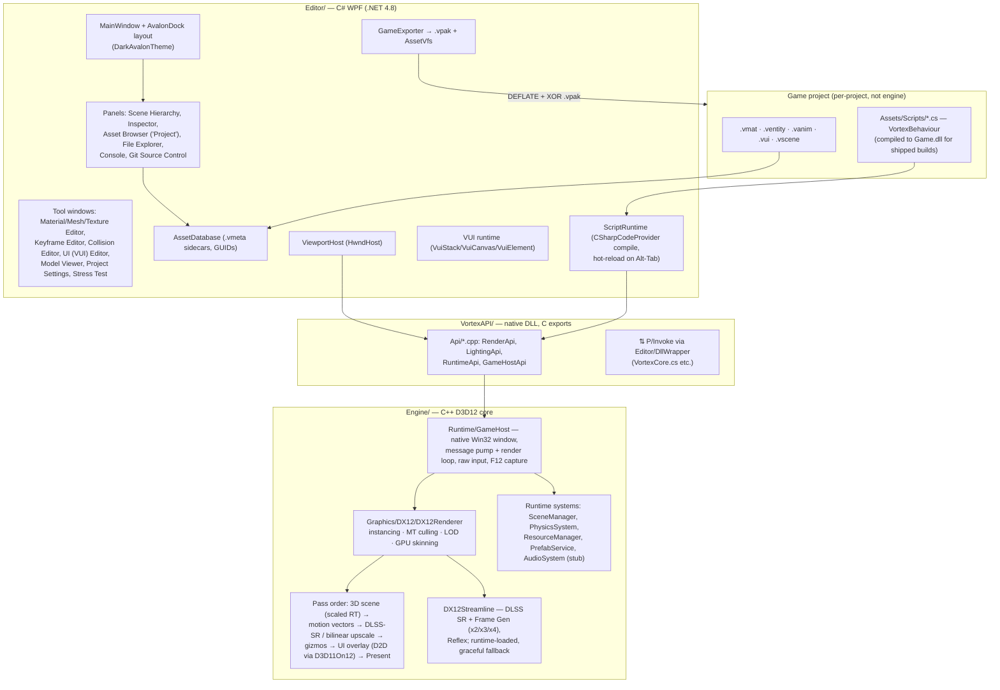

# Architecture

Vortex Engine (v2.5.1, MIT) is a Windows-native engine built as **three layers**: a native C++ core (`Engine/`, Direct3D 12), a C interop layer (`VortexAPI/`), and a C# WPF editor (`Editor/`). Gameplay code lives in **project scripts** (`VortexBehaviour` C#), never in the engine itself.

## Layer 1 — `Engine/` (native C++, Direct3D 12)

Forward PBR renderer (Cook-Torrance GGX, 16 point + 8 spot + 1 directional light, ACES tonemap) with a fixed pass sequence. Key subsystems:

- **GameHost** (`Engine/Runtime/GameHost.{h,cpp}`) — a dedicated native thread owns the Win32 window, message pump and render loop (step → render → present). Uncapped FPS via `DXGI_PRESENT_ALLOW_TEARING` (~1850 FPS verified in simple scenes). Raw-input mouse capture (WM_INPUT deltas), borderless-fullscreen F11 toggle, deferred resize/scene-switch (no Present freeze), F12 native back-buffer capture to BMP.
- **Render-scale → DLSS → UI pass order** — the 3D scene renders into a scaled offscreen RT (`set_render_scale`, 0.25–2.0), then a motion-vector pass (`motionvector.hlsl`, RG16F, camera reprojection), then either DLSS Super-Resolution (Streamline) or the bilinear `upscale.hlsl` composite, then gizmos, then the 2D UI overlay (Direct2D/DirectWrite on D3D11On12), then Present. DLSS Frame Generation (x2/x3/x4) with Reflex markers hooks the Present. Streamline DLLs are loaded dynamically; everything no-ops without them.
- **Instancing / culling / LOD** — per-instance world matrices streamed in vertex-buffer slot 1; draws sorted by (material, mesh, distance) into single `DrawIndexedInstanced` runs (max 8192 runs, 262k instances). 2-pass multithreaded frustum + distance culling with prefix-sum compaction, plus a parallel pre-cull above 262k submissions. Geometric LOD: up to 4 decimated LOD levels per mesh (vertex-cluster decimation, `MeshDecimator.h`) selected by distance; density LOD thins distant instances. Verified: 63k instances @ 240 FPS.
- **GPU skinning** — 52-byte interleaved skinned vertex, `skinned.hlsl` VS, bone palettes (up to 32K matrices/frame) in dual-half persistently-mapped upload buffers; each skinned item is its own draw run.
- **Runtime systems** — `SceneManager`, `PhysicsSystem` (collide-and-slide character controller, AABB dynamics, trigger events), `ResourceManager` (path/GUID loading, ref-counting), `PrefabService`, `AudioSystem` (stub today — [milestone v2.6.0](https://github.com/shadow-kernel/Vortex-Engine/milestone/1) implements it).

Known architectural gaps (tracked as issues): hard-coded pass sequence (render graph planned in [v4.0.0](https://github.com/shadow-kernel/Vortex-Engine/milestone/10)), no shadow maps / transparency blending / post-FX chain yet ([v2.7.0](https://github.com/shadow-kernel/Vortex-Engine/milestone/2)), single SRV heap (no bindless), no occlusion culling ([v3.4.0](https://github.com/shadow-kernel/Vortex-Engine/milestone/9)).

## Layer 2 — `VortexAPI/` (C interop)

A native DLL exporting a flat C API consumed by the editor through P/Invoke wrappers in `Editor/DllWrapper/` (e.g. `VortexCore.cs`). `VortexAPI/Api/*.cpp` groups the exports by domain: `RenderApi` (mesh/material/instancing submission), `LightingApi` (`SetDirectionalLight` etc.), `RuntimeApi` (runtime lifecycle incl. the audio init/update/shutdown hooks), `GameHostApi` (`RunGameHost`, `SetGameTickCallback`, input snapshots, `SetMaterialShader`/`ReloadMaterialShaders`). Shipped games run the same path: the standalone player consumes the project's compiled script assembly (**Game.dll**, produced by RELEASE export) against `VortexAPI.dll` — no loose `.cs` files on disk.

## Layer 3 — `Editor/` (C# WPF + AvalonDock)

WPF shell with native DWM chrome, dark Apple-inspired theme (`VortexTheme.xaml`, #161618 bg / #6C5CE7 accent), AvalonDock 4.x docking in a 4-column layout: `[Scene/FileSystem] | [Viewport/Assets/Console] | [Inspector]`. The DX12 viewport is embedded via `ViewportHost` (HwndHost).

**Window/panel catalog** (all verified in the codebase):

| Window / panel | File |
|---|---|
| Scene Hierarchy (TreeView + SelectionService) | `Editor/Editors/WorldEditor/Components/SceneHierarchy/SceneHierarchyView.xaml.cs` |
| Dynamic Inspector (Transform/MeshRenderer/Camera/Light/Skybox/Script/Collider/Animator) | `Editor/Editors/WorldEditor/Components/Inspector/DynamicInspectorView.xaml.cs` |
| Viewport (GamePreview, gizmos, play mode) | `Editor/Editors/WorldEditor/Components/GamePreview/GamePreviewView.xaml.cs` |
| Asset Browser ("Project" tab: Explorer/Meshes/Models/Textures/Materials/Scripts) | `Editor/Editors/WorldEditor/Components/AssetBrowser/AssetBrowserView.xaml.cs` |
| File Explorer (disk browser, drag-drop into scene) | `Editor/Editors/WorldEditor/Components/FileExplorer/` |
| Header Bar (menus, Play/Pause/Stop, gizmo tools) | `Editor/Editors/WorldEditor/Components/HeaderBar/HeaderBarView.xaml.cs` |
| Material Editor (live sphere preview, shader hot-reload) | `Editor/Dialogs/MaterialEditorDialog.cs` |
| Mesh Inspector / Texture Editor | `Editor/Dialogs/MeshEditorDialog.cs`, `Editor/Dialogs/TextureEditorDialog.cs` |
| Collision Editor (Box/Sphere/Capsule/Mesh, live wireframe) | `Editor/Editors/PhysicsEditor/CollisionEditorWindow.cs` |
| Keyframe/Animation Editor (dope sheet, bone tree, event markers) | `Editor/Editors/AnimationEditor/AnimationEditorWindow.cs` |
| UI (VUI) Editor (palette, hierarchy, anchor picker, resolution presets) | `Editor/Editors/UIEditor/UIEditorWindow.cs` |
| Git Source Control (branch/diff/commit/push/stash) | `Editor/Editors/WorldEditor/Components/Git/GitWindow.xaml.cs` |
| Project Browser / Project Settings | `Editor/Project/Projection/ProjectBrowserWindow.xaml`, `ProjectSettingsWindow.xaml` |
| Model Viewer tab, Camera Preview PIP, Stress Test dialog, Splash | `.../ModelViewer/ModelViewerControl.cs`, `.../CameraPreview/`, `Editor/Dialogs/StressTestDialog.cs` |

Editor services: `UndoRedoManager` (100-command stack, 500 ms merge window), `WindowService` (panel visibility + ResetLayout), `EditorStateService` (AppData persistence), toast notifications, shader + script hot-reload on window activation.

### Asset pipeline

- **AssetDatabase** (`Editor/Core/Assets/AssetDatabase.cs`) scans `Assets/` recursively; every asset gets a **`.vmeta` JSON sidecar** (`AssetMetadata.cs`): stable GUID, type, relative path, import date, last-modified, size, dependency GUIDs, import settings, tags. No content hash yet — SHA-256 hashing and a machine-wide library come in [v2.8.0 Global Asset DB](https://github.com/shadow-kernel/Vortex-Engine/milestone/3).
- **Import**: Assimp models (`.fbx .obj .gltf .glb .dae .3ds .blend .vmesh` via `ModelImportService.cs`), textures (`.png .jpg .tga .bmp .hdr .dds`), with an import dialog (tags, target folder, auto-detect embedded textures). Thumbnails render offscreen via `AssetPreviewRenderer.cs` (D3D12 render-to-bitmap, studio lighting).
- **Asset formats**: `.vmat` PBR materials (JSON, blend modes, custom `.hlsl` ShaderAsset slot), `.ventity` prefabs (`PrefabService.cs`, Apply/Revert, linked instances), `.vanim` animation clips (name-keyed tracks + event markers), `.vui` retained-mode UI screens, `.vscene` scenes.
- **Shipping**: `GameExporter.cs` packs assets into **`.vpak`** (DEFLATE + XOR-obfuscated, `VortexPak.cs`) — a core `Assets.vpak` plus per-scene `Scenes/<name>.vpak` layers. The shipped player mounts them in RAM through **`AssetVfs.cs`** (MountLayer/UnmountLayer for scene streaming); the editor always reads loose files.

### VUI (2D UI engine)

Retained-mode screen system: `VuiDocument` (JSON `.vui`) → `VuiElement` tree → `VuiCanvas` (Layout/Update/Render per frame) → `VuiStack` (screen stack: bottom = HUD, top = modal, input top-first). 11 widget kinds (Panel, Text, Image, Button, Toggle, Slider, Stepper, TextField, Bar, Crosshair, List with row pooling), 9-point anchoring + stretch/percent layout, design resolution 1920×1080. Rendering goes through the native `UIOverlay` (D2D + DirectWrite on D3D11On12 over the D3D12 swapchain). Button `ClickAction`s auto-route to a per-screen `<ScreenName>Actions` C# class in the project.

## Scripting model

Gameplay is **100% project-side**: scripts in `Assets/Scripts/*.cs` derive from `VortexBehaviour` (`Editor/Scripting/VortexScriptApi.cs`) with a `Start()` / `Update(float dt)` / `OnDestroy()` lifecycle plus `OnTriggerEnter/Stay/Exit`, `OnCollisionEnter` and `OnAnimationEvent` callbacks. `ScriptRuntime.cs` compiles all project scripts into one in-memory assembly at Play (CSharpCodeProvider), dispatches events, and hot-reloads on refocus — compile errors keep the old scripts running. The `Vortex` namespace exposes Input (keyboard/mouse/gamepad), Transform, Physics (`MoveCharacter`, collide-and-slide), Scene, Camera, Cursor, Lighting, Settings (VSync/resolution/render scale/DLSS/frame-gen), Time, UI (immediate-mode) and Gui (VUI screens).

The philosophy: health, weapons, controllers, menus, AI — all live in game scripts (see `Templates/Default3D/Assets/Scripts/Player/PlayerController.cs` for the full first-person controller example), so the engine stays generic. Engine-side script gaps (Instantiate/Destroy, coroutines, Physics.Raycast, save/load, `Debug.Log`) are the core of [milestone v2.7.0 Horror Essentials](https://github.com/shadow-kernel/Vortex-Engine/milestone/2); a full script-facing tour lives in the scripting issues under [`area:scripting`](https://github.com/shadow-kernel/Vortex-Engine/issues?q=is%3Aissue+label%3Aarea%3Ascripting).

## Key directories & files

| Path | Role |
|---|---|
| `Engine/Runtime/GameHost.{h,cpp}` | Native window + message pump + render loop, input snapshot, F12 capture |
| `Engine/Graphics/DX12/DX12Renderer.{h,cpp}` + `DX12Renderer_3DScene.cpp` / `DX12Renderer_Lights.cpp` | Core renderer: RenderItem queue, instancing, MT culling, lights |
| `Engine/Graphics/DX12/DX12Pipeline3D.{h,cpp}` | PSOs: standard / wireframe / double-sided / skinned / gizmo, custom-shader PSO cache |
| `Engine/Graphics/DX12/DX12Streamline.{h,cpp}` | DLSS SR + Frame Gen + Reflex (runtime-loaded Streamline) |
| `Engine/Graphics/DX12/DX12UpscalePipeline.h` / `DX12MotionVectorPipeline.h` | Render-scale upscale pass, motion-vector pass |
| `Engine/Graphics/DX12/UIOverlay.{h,cpp}` | D2D/DirectWrite 2D overlay (rects/text/images/clip) |
| `Engine/Shaders/standard.hlsl`, `skinned.hlsl`, `skybox.hlsl`, `motionvector.hlsl`, `upscale.hlsl` | Core shader set |
| `Engine/Graphics/Resources/ResourceRegistry.h` + `ResourceRegistry_Lod.cpp`, `Engine/Graphics/Geometry/MeshDecimator.h` | Texture/mesh registry, SRV heap, LOD chain building |
| `Engine/Runtime/Systems/PhysicsSystem.{h,cpp}` / `AudioSystem.{h,cpp}` | Character physics + AABB dynamics; audio stub |
| `VortexAPI/Api/RenderApi.cpp`, `LightingApi.cpp`, `RuntimeApi.cpp`, `GameHostApi.cpp` | C exports consumed via P/Invoke |
| `Editor/DllWrapper/Core/VortexCore.cs` | P/Invoke wrapper layer |
| `Editor/MainWindow.xaml(.cs)`, `Editor/Editors/WorldEditor/WorldEditorView.xaml` | Shell + AvalonDock layout |
| `Editor/Core/Assets/AssetDatabase.cs`, `AssetMetadata.cs`, `AssetTagService.cs`, `DependencyResolver.cs` | GUID asset registry + .vmeta pipeline |
| `Editor/Core/Services/Build/GameExporter.cs`, `VortexPak.cs`, `Editor/Core/Services/AssetVfs.cs` | Export, .vpak format, shipped-game VFS |
| `Editor/Core/Services/PrefabService.cs` | .ventity prefabs (instantiate/apply/revert) |
| `Editor/Scripting/VortexScriptApi.cs`, `ScriptRuntime.cs` | Public `Vortex` API + script compiler/host |
| `Editor/UI/Vui/VuiDocument.cs`, `VuiCanvas.cs`, `VuiElement.cs`, `VuiStack.cs` | VUI retained-mode runtime |
| `Templates/Default3D/` (git submodule) | 3D starter project: scripts, UI screens, assets |
| `.github/workflows/build-release.yml`, `Installer/VortexEngine.iss` | CI release pipeline + Inno Setup installer |
| `ROADMAP_NATIVE_RENDER.md` | Native-render roadmap notes in-repo |

See the milestone plan ([v2.6.0 Audio](https://github.com/shadow-kernel/Vortex-Engine/milestone/1) → [v4.0.0 XXL 10x Performance](https://github.com/shadow-kernel/Vortex-Engine/milestone/10)) for where each layer evolves next.
