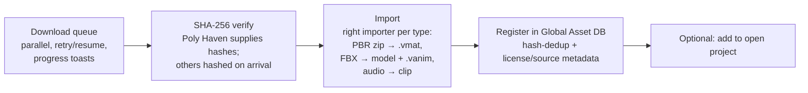

# Design: Asset Store Integrations

**Status:** Design / planned for [v2.9.0 – Asset Store & Claude Sound Studio](https://github.com/shadow-kernel/Vortex-Engine/milestone/4) — builds on the [v2.8.0 Global Asset Database](https://github.com/shadow-kernel/Vortex-Engine/milestone/3)
**Related:** [[Design-Global-Asset-Database]] (every download lands there first)
**Issues:** [`area:asset-store`](https://github.com/shadow-kernel/Vortex-Engine/issues?q=is%3Aissue+label%3Aarea%3Aasset-store)

Provider facts below were live-verified July 2, 2026 (HTTP status checks, API docs, license pages).

## IAssetProvider Abstraction

One interface, many backends — so fragile providers (Sketchfab → Fab) can be swapped without touching the Store UI:

- `Search(query, category/type, page)` → results with name, author, thumbnail URL, license, formats
- `Categories()` — provider-specific browse taxonomy
- `ResolveDownload(assetId)` → concrete download URL(s) + expected size + (where available) SHA-256
- `LicenseInfo(asset)` → license id, author, source URL, attribution requirement, redistributable flag
- Capability flags: anonymous vs. per-user key vs. OAuth vs. no-API (WebView/guided flow)

The **Store tab** UI shell: provider tiles, search box, result grid with thumbnails, detail panel with a prominent **license badge**, download queue with progress, and an **attribution display area** (Poly Haven's API ToS requires attribution "directly next to the content itself" inside the browser UI).

## Provider Table

### Tier 1 — anonymous HTTP, all CC0, ship first

| Provider | API | Auth | License | Formats | Integration approach |
|---|---|---|---|---|---|
| **Poly Haven** (models, PBR textures, HDRIs) | Full REST, verified 200: `https://api.polyhaven.com` — `/assets?type=hdris\|textures\|models`, `/info/{id}`, `/files/{id}` (direct CDN URLs **+ SHA256 hashes** + sizes), `/categories/{type}`, `/authors/{id}`. No documented rate limits. | None — but a **unique `User-Agent`** (e.g. `VortexEngine/2.5`) is MANDATORY or requests get blocked. Commercial API use needs a custom license they "generally give out freely" — send them one email. | All assets CC0, commercial OK. API ToS: show "Poly Haven" attribution next to results in the UI. | Models: glTF + FBX + .blend + USD; textures PNG/JPG/EXR 1K–8K per map; HDRIs .hdr/.exr | Direct HTTP download from `/files` CDN URLs; verify their SHA256 against our own hash; glTF/FBX goes through the existing Assimp import path. Cleanest of the ten. |
| **ambientCG** (PBR materials) | REST **v3** (launched Feb 28, 2026 — use it, v1/v2 are legacy): `https://ambientcg.com/api/v3/assets?limit&offset&q&type&sort&include=downloads`; also `/categories`, `/collections`. Docs: docs.ambientcg.com/api/v3/. 2,862 assets. | None. GET-only. Run by one person — cache aggressively, be polite. | Everything CC0, commercial OK, zero attribution. | PBR map zips 1K–16K JPG/PNG (+ USD, Blender, Godot .tres, OpenPBR .mtlx variants since Oct 2025) | Downloads go through the **`/get` redirect** (raw CDN links removed early 2025) — `HttpClient` must follow redirects. Killer feature: unzip the PBR maps and **auto-create a ready `.vmat`** (albedo/normal/rough/AO/height wired) — 1 click = usable material. |
| **poly.pizza** (Quaternius, Google Poly archive, low-poly CC0) | REST `https://api.poly.pizza/v1.1` — `/search/{keyword}`, `/model/{id}`. Docs: poly.pizza/docs/api/v1.1. | Free per-user API key in **`x-auth-token`** header (verified: 401 without key). Key can't ship in a public binary → editor-settings field where the user pastes their own. | CC0, commercial OK, no attribution (confirmed for Quaternius packs). | glTF/GLB via API; many packs rigged + animated (pairs with the skeletal animation system) | Direct download → Assimp import. One integration covers ~1,400 Quaternius models plus the Google Poly archive. |

### Tier 2 — per-user account/key

| Provider | API | Auth | License | Formats | Integration approach |
|---|---|---|---|---|---|
| **Freesound** (SFX) | REST v2 `https://freesound.org/apiv2/` — `/search/text/?query=...&filter=license:...`, `/sounds/{id}/`, `/sounds/{id}/download/` (OAuth2); preview URLs in every sound object. Rate limits: 60 req/min, 2,000 req/day. | Free account → API credentials from `freesound.org/apiv2/apply`. Token auth for search/metadata/**preview** downloads; full OAuth2 required for original-quality files. Verified: 401 anonymous. | Per sound: CC0, CC-BY 4.0, CC-BY-NC 4.0 (+ legacy). **NC is unusable in commercial games** — the search API supports a license filter; UI defaults to CC0 + CC-BY. | Originals: WAV/AIFF/FLAC/OGG/MP3; previews: auto-generated MP3+OGG (~128 kbps HQ) | v1 = token-only (user pastes free key): search + audition previews in the Store tab + preview-quality downloads with license filter. OAuth2 for original WAVs later. Credits recorded for CC-BY. |
| **Sketchfab** (1M+ downloadable CC models) | Data API v3: `https://api.sketchfab.com/v3/search?type=models&downloadable=true&q=...` (verified 200 anonymous). Download: `GET /v3/models/{uid}/download` with auth → temporary expiring archive URLs. | Search anonymous; downloads need the end-user's Sketchfab account — OAuth2 login in-app or personal API token. | Per-model CC: CC0, CC-BY, CC-BY-SA, CC-BY-NC(-SA/-ND). **Must render the license field + author attribution per model**; ideally filter out NC/ND for game use. | Via API: glTF, GLB, USDZ **only** (no source FBX/OBJ) | glTF/GLB → Assimp. Cache downloads (their guidelines require it; URLs expire). **Architect for swap-out**: store closed Oct 2024, Epic says the Download API works "until new APIs are made available on Fab" — still live July 2026, but expect churn. |

### Tier 3 — no API, honest flows

| Provider | API | Auth | License | Formats | Integration approach |
|---|---|---|---|---|---|
| **Adobe Mixamo** (character animations) | **No official or public API** — confirmed, none announced. Web app internally uses `www.mixamo.com/api/v1/*` with a session Bearer token; community downloaders ride it and break whenever Adobe changes the site. Maintenance mode since ~2020 but operational and free. | Free Adobe ID (browser-based Adobe IMS login; no developer key program). | Royalty-free personal + commercial use embedded in projects/games; **redistribution of raw characters/animations as standalone assets is prohibited** — never re-host or bundle. | FBX (binary/ASCII), "FBX for Unity", DAE; no glTF | Embed mixamo.com in **WebView2** inside the Store tab (user logs in), hook **`CoreWebView2.DownloadStarting`** to intercept the FBX and route it into the existing Assimp animation import (skeleton + clips → `.vanim`) → global DB. Fallback: guided-download drop-target. Do NOT ship the unofficial API. Treat as convenience, not a pillar — Adobe could sunset it with little notice. |
| **Kenney.nl** (60k+ CC0 UI/audio/3D assets) | No official API. Verified: the asset page HTML contains a direct ZIP href — `https://kenney.nl/media/pages/assets/{slug}/{hash}-{timestamp}/kenney_{slug}.zip`; hash segment is unguessable, so fetch `kenney.nl/assets/{slug}` and regex the `.zip` href (verified working). | None — anonymous direct ZIPs (verified HTTP 206 on a range request). | All CC0, commercial OK, no attribution. | PNG spritesheets + XML/JSON atlases, 3D glTF/OBJ/FBX, OGG/WAV audio, fonts | Curated JSON pack manifest shipped/updated per engine release, page-scrape as resolver. Scraping is unsanctioned (no API ToS exists) but Kenney is tooling-friendly — email him for a blessed manifest endpoint. Great fit for VUI sprites + placeholder audio. |
| **Sonniss GDC bundles** (pro game audio) | No API. Yearly multi-GB archives (2015–2024, ~8 collections, tens of GB each) on downloads.sonniss.com + mirrors + official torrents. | No account needed, BUT sonniss.com/downloads.sonniss.com returned **HTTP 403 to plain HTTP clients** (Cloudflare bot protection) — naive editor `HttpClient` pulls will be blocked. | Royalty-free, unlimited lifetime commercial use, no attribution. **CRITICAL: redistribution as standalone files or as a sound library is prohibited** — no re-hosting, no bundling in the engine. AI/ML training explicitly prohibited. | Professional WAV (16/24-bit, 44.1–96 kHz) | **Guided download + local indexer**: store tile opens the Sonniss page in the browser, user downloads + extracts, engine watches the folder and indexes WAVs into the global DB — marked **non-redistributable** and excluded from library export. |
| **OpenGameArt.org** | No official API (confirmed via their forums; Drupal site). Only stale community scrapers. Weak infra, hotlinking discouraged. | None. | **MIXED per asset — the biggest hazard**: CC0, CC-BY 3.0/4.0, CC-BY-SA, GPL 2.0/3.0, OGA-BY. SA/GPL are viral; per-asset attribution required. | Everything (PNG, OGG, WAV, .blend, FBX, XCF…), quality variable | **Link-out / WebView tile only.** No direct download/import. If ever integrated: hard-require per-asset license display + confirm dialog. |
| **itch.io** | Official server-side API (`https://api.itch.io`) but **account-scoped only**: profile, own games, purchases/download-keys, downloads of owned games. **No public catalog search endpoint** — browsing "free game assets" programmatically = ToS-gray scraping (their docs page itself 403'd our fetch). | API key (Bearer) from user account settings, or OAuth2 apps. All endpoints require auth. | Per-creator, per-asset — no machine-readable license field guaranteed. Many CC0/CC-BY packs (incl. Kenney/Quaternius mirrors) but must be read per page. | Arbitrary (creator-uploaded archives) | (1) Link-out/WebView tile for browsing the game-assets section; (2) legitimate **"import my itch.io purchases"** using the user's own API key + download-key endpoints. Skip generic scraping. |

## Download Pipeline

The 1-click promise, shared by all providers:

If the asset's hash is already in the library, the download is **skipped entirely** — see [[Design-Global-Asset-Database]].

## License & Attribution Manager

Recorded in the global catalog per store asset: **license + author + source URL**. On game export, a `CREDITS.md` / ATTRIBUTIONS file is **generated automatically** (CC-BY compliance — Sketchfab and Freesound need this), and the build warns when NC- or SA-licensed assets land in a commercial build.

## Legal Rules (hard requirements)

- **Never re-host Mixamo or Sonniss content.** Both licenses prohibit redistribution as standalone assets/libraries. Their entries are flagged non-redistributable in the global DB and excluded from library export bundles.
- **Freesound NC filter**: the license filter in the Store UI defaults to CC0 + CC-BY; CC-BY-NC results are excluded for commercial games unless the user opts in knowingly.
- **Poly Haven attribution**: "Poly Haven" shown directly next to their content in the Store UI (API ToS), plus the one-time email for the free commercial-API license.
- **Sketchfab attribution**: per-model CC license + author rendered in the UI and exported to credits; BY variants require it.
- **No shared API keys in the shipped editor** (poly.pizza, Freesound, itch.io): per-user keys entered in editor settings, or a small Vortex proxy service later.
- **Cache aggressively** — ambientCG is one person's server; Sketchfab's guidelines require caching models rather than re-downloading.
- **OpenGameArt / itch.io browsing = link-out only** — mixed/viral licenses and no sanctioned APIs make auto-import a legal footgun.
