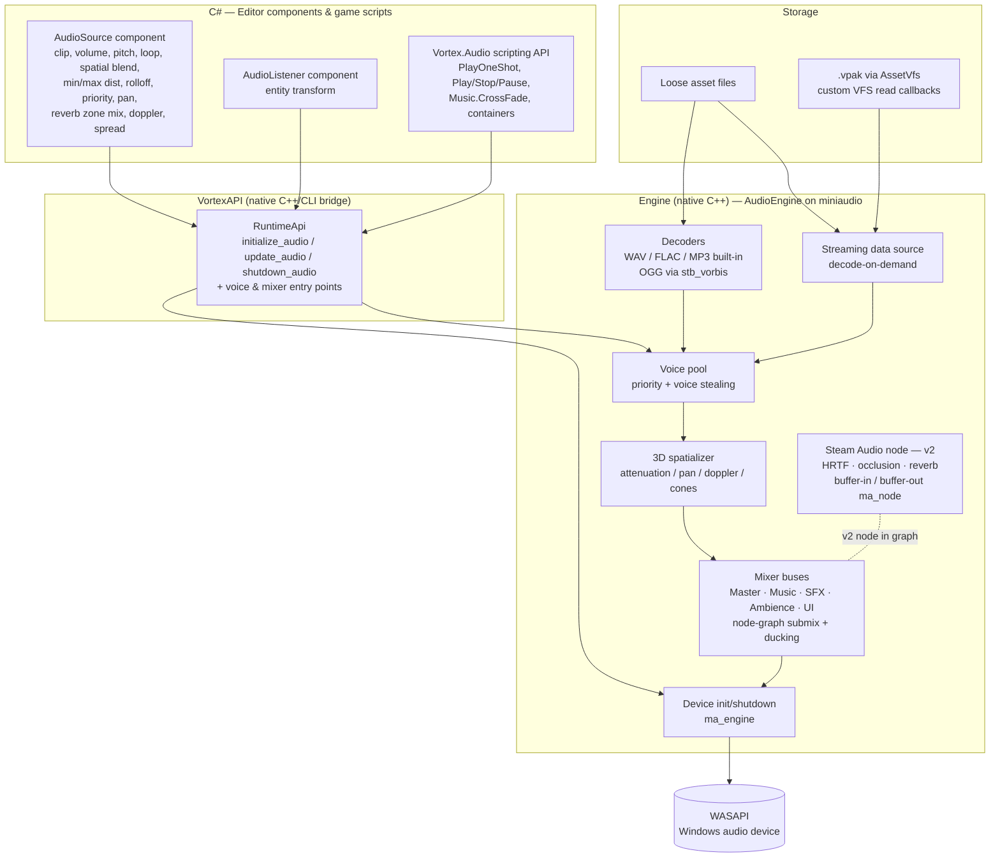

# Design: Audio Engine

**Status:** Approved design — implementation tracked in [Milestone v2.6.0 – Audio Engine](https://github.com/shadow-kernel/Vortex-Engine/milestone/1) · Issues: [`area:audio`](https://github.com/shadow-kernel/Vortex-Engine/issues?q=is%3Aissue+label%3Aarea%3Aaudio)

Audio is **blocker #1** for the first-person horror game: the engine currently has a 34-line audio stub — no decoder, no device, no listener integration, no `Vortex.Audio` facade. Horror requires 3D positional cues, ambience loops, and stingers before game development can start.

---

## 1. Goals

1. **Real playback** for the already-complete `AudioSource`/`AudioListener` editor components (play/stop/pause, volume, pitch, loop).
2. **3D spatial audio v1** — distance attenuation, panning, doppler, cones — driven by entity transforms; **HRTF is explicitly v2** (Steam Audio).
3. **Mixer** — buses (Master/Music/SFX/Ambience/UI), routing, ducking; Audio Mixer editor window with faders and live meters.
4. **Streaming** — music and long ambience decoded on demand, from loose files *and* from shipped `.vpak` archives.
5. **Scripting API** (`Vortex.Audio`) — gameplay audio lives in project scripts (VortexBehaviour), never hardcoded in the engine, per project philosophy.
6. **Editor tooling** — 3D gizmos (range spheres, speaker icons), edit-mode audition, waveform previews, audio import pipeline.
7. **License-clean** — everything vendorable into a public MIT repo with zero downstream obligations for engine users.
8. **Horror-grade extras** — random sound containers (footsteps/creaks), fade envelopes, reverb zones.

---

## 2. Decision record: audio backend

**Decision: miniaudio as the core engine (v1), Steam Audio as a v2 DSP node on top. XAudio2, FMOD, Wwise, OpenAL Soft rejected.**

Research snapshot: July 2026, versions verified against upstream.

### Chosen: miniaudio (v0.11.25, Mar 2026)

| Aspect | Detail |
|---|---|
| License | Dual: public domain (Unlicense) **or** MIT-0 — fully vendorable into the MIT repo, zero obligations, commercial OK, no attribution |
| Form | Single-file C header (`github.com/mackron/miniaudio`), compiled in one TU with `MA_IMPLEMENTATION` |
| Backend | WASAPI on Windows |
| Features | High-level `ma_engine`/`ma_sound` API: playback, mixing, volume/pitch, **built-in 3D spatialization** (distance attenuation, doppler, cone/pan — not HRTF), **node-graph system** for custom DSP chains, **built-in WAV/FLAC/MP3 decoders** (+ Vorbis via stb_vorbis) |
| Integration effort | Lowest of all options (~hours). Pure C API — wraps cleanly behind the native VortexAPI layer (same 3-layer split used everywhere else in the engine), P/Invoke-friendly |
| Known weakness | No authoring tool, no event system — the "game audio" layer (banks, events, snapshots) is ours to build, which fits the gameplay-in-scripts philosophy |

The **node graph is the strategic hook**: Steam Audio slots in later as a custom `ma_node` for HRTF/occlusion/reverb without replacing the core.

### Chosen (v2): Steam Audio (Valve, v4.8.1, Feb 2025)

- **Apache-2.0**, fully open source (`github.com/ValveSoftware/steam-audio`) — vendorable/redistributable inside an MIT repo (keep NOTICE). No Steam account or API key required; free for commercial use on all stores.
- It is **not an output engine** — it is a buffer-in/buffer-out DSP + simulation library: `iplBinauralEffect` (HRTF, custom SOFA files), ray-traced occlusion (incl. partial occlusion + transmission through geometry), baked/real-time reflections & reverb, sound pathing, Ambisonics.
- Its C API is explicitly designed "to add spatial audio to any application, such as custom game engines". You feed it scene geometry (triangle meshes — Vortex already has mesh data + a CollisionService for occlusion rays) and per-source dry buffers; it returns wet/spatialized buffers submitted back into the miniaudio node graph. "Steam Audio on top of miniaudio" is a **confirmed-supported architecture**.
- Effort: moderate (~days) on top of a working mixer; the simulation thread + geometry export are the real work.

### Rejected alternatives

| Option | Why rejected |
|---|---|
| **XAudio2 (2.9)** | Free (ships in Win10/11, not deprecated), but strictly **more plumbing for the same result**: no decoders (raw PCM/ADPCM only — needs Media Foundation or own decoders for OGG/MP3), no node graph, no HRTF (Windows Sonic lives in the separate ISpatialAudioClient API), hand-rolled voice pooling/streaming, COM-style C++ API with no C# story, and **Windows-only** — kills any future cross-platform port. Steam Audio has no official XAudio2 plugin (you'd write an xAPO yourself). No licensing gain over miniaudio. |
| **FMOD Core** | Best out-of-box C# story and very low effort, but **proprietary per-title licensing is unacceptable for an MIT engine**: free Indie tier requires registration + attribution and caps budget/revenue ($600k / $200k); paid tiers ~$2k–$18k per title. It **cannot be redistributed inside a public MIT repo** — every downstream game dev on Vortex would need their own FMOD license. |
| **Wwise** | Same licensing wall (free Indie < $250k budget, re-verified at milestones, quote-based paid tiers, not vendorable) plus the **highest integration effort of all options** (~weeks: IO/memory hooks, streaming manager, SoundBank pipeline). Its main value — designer authoring tooling — duplicates what Vortex's own editor wants to own. |
| **OpenAL Soft (v1.25.2)** | The only playback option with built-in HRTF + EFX reverb, but: **LGPL-2.0-or-later** means DLL-shipping ceremony (dynamic linking only — not copy-paste vendorable), no decoders, no node graph, aging OpenAL 1.1 API design, smaller momentum. A middle-ground pick we don't need once Steam Audio covers HRTF. |

**Phasing:** v1 = miniaudio playback + its built-in distance/pan spatialization (Milestone 1). v2 = Steam Audio node for HRTF + ray-traced occlusion + reverb baking — tracked as its own `needs-design` issue in Milestone 1 with a dedicated design doc to follow.

---

## 3. Architecture



Key flow: on play-mode start, each `AudioSource` gets a native voice; per-frame the runtime syncs source/listener transforms into the spatializer; scripts drive everything else through `Vortex.Audio`. Streaming sources read through custom VFS callbacks so the same path serves loose files in the editor and `.vpak` entries in shipped games.

---

## 4. What ALREADY exists (verified)

| Piece | State | Detail |
|---|---|---|
| `AudioSource` component | **Complete (editor)** | `Editor/ECS/Components/Audio/AudioSource.cs` — serialization + properties for clip path, volume, pitch, loop, spatial blend, min/max distance, rolloff mode, priority, stereo pan, reverb zone mix, doppler level, spread. Integrated into `GameEntity` and `DataSerializer`. |
| `AudioListener` component | **Complete (editor)** | Same file (`AudioListener` class); serialized and registered in `GameEntity`. |
| Editor UI | **Complete** | `HeaderBarView.xaml.cs` `AddAudioSource_Click()`; `SceneHierarchyViewModel` `CreateAudioSourceCommand`/`CreateAudioSource()`; `EntityConverters` prioritizes AudioSource in icon selection. |
| `AudioSystem` | **Stub** | `Engine/Runtime/Systems/AudioSystem.h/.cpp` — `initialize_audio()`, `shutdown_audio()`, `update_audio(float dt)` set flags only; `update_audio` carries the TODO: "update 3D voices, listener transform, streaming." |
| Resource loading | **Stub** | `ResourceManager::load_audio(path)` just returns `load_resource(path)` — no decoding or format support. |
| Runtime wiring | **Stub (wired)** | `VortexAPI/Api/RuntimeApi.cpp` already calls `initialize_audio()/update_audio(dt)/shutdown_audio()` in the runtime lifecycle — the plumbing exists, only the backend is missing. |
| Asset typing | **Partial** | `AssetDatabase.DetermineAssetType()` already maps `.wav`/`.mp3` → `Audio`. |

Translation: **the entire component/serialization/editor surface is done.** The v2.6.0 work is the native backend plus the bridge, tooling, and API.

---

## 5. Phased plan → v2.6.0 issues

All in [Milestone 1 (v2.6.0 – Audio Engine)](https://github.com/shadow-kernel/Vortex-Engine/milestone/1), under the epic *"Audio Engine v1 — miniaudio backend, 3D audio, mixer, editor tooling"* ([`horror-blocker`](https://github.com/shadow-kernel/Vortex-Engine/issues?q=is%3Aissue+label%3Ahorror-blocker)).

**Phase A — Core (P0)**
1. **Vendor miniaudio + native AudioEngine core** — device init/shutdown in `AudioSystem.cpp`, WAV/FLAC/MP3 built-in + stb_vorbis for OGG, replace `load_audio` stub, WASAPI backend, THIRD-PARTY-NOTICES entries.
2. **Voice management** — voice pool with configurable max; honor the existing `AudioSource.priority` when stealing; exposed via `RuntimeApi`.
3. **Wire AudioSource/AudioListener to native playback** — voices created on play-mode start, per-frame position sync, PlayOnAwake.
4. **3D spatialization v1** — miniaudio spatializer mapped to the existing rolloff-mode property; cones/pan/doppler; listener = `AudioListener` entity transform. HRTF out of scope.
5. **Vortex.Audio scripting API** (see §6).

**Phase B — Pipeline & mixer (P1)**
6. **Streaming playback** — miniaudio streaming data source; loose files + `.vpak` via custom VFS read callback.
7. **Audio import pipeline** — `.wav`/`.ogg`/`.mp3` with `.vmeta`, waveform thumbnails, click-to-audition in Asset Browser, drag onto AudioSource clip slot.
8. **Mixer core** — buses (Master/Music/SFX/Ambience/UI) as node-graph submix groups; bus config serialized with project; sidechain-style ducking (dialogue ducks music).
9. **Audio Mixer window** — AvalonDock window (pattern: Keyframe/Collision Editor); faders bound to buses, live RMS/peak meters in play mode.
10. **3D audio gizmos** — min/max distance spheres for selected AudioSource (reuses the existing always-on-top depth-disabled gizmo pass), billboard speaker icons, live audition while moving the source.
11. **Edit-mode audition** — inspector Play/Stop button, "listen from camera" toggle, no play mode required.
12. **Ship audio in game export** — `.vpak` audio entries (DEFLATE+XOR format exists), streaming from pak via AssetVfs, per-bus user volume settings persisted in the shipped game.

**Phase C — Horror polish (P2)**
13. **Reverb zones** — ReverbZone component (box/sphere extent), listener-position blending; the existing `reverbZoneMix` property finally does something; algorithmic (freeverb-style) reverb as a custom miniaudio node.
14. **Random sound containers** — clip list + random pitch/volume ranges + no-repeat shuffle; the footsteps/creaks feature; playable via `Vortex.Audio`.
15. **Fade envelopes** — lerp-based volume envelopes; `Music.CrossFade(clip, seconds)`.

**Phase D — v2 spatializer (P2, `needs-design`)**
16. **Steam Audio integration** — HRTF binaural + ray-traced occlusion (reusing CollisionService geometry) + reverb baking, as a custom miniaudio node. Design doc first.

---

## 6. `Vortex.Audio` API sketch

Gameplay stays in project scripts (VortexBehaviour) — the engine only provides the facade. Final surface is designed in the scripting-API issue; sketch:

```csharp
// Fire-and-forget 3D one-shot at a world position
Audio.PlayOneShot("Assets/Audio/door_slam.wav", position);
Audio.PlayOneShot(clip, position, volume: 0.8f);

// Component-driven playback (bridges to the entity's AudioSource voice)
audioSource.Play();
audioSource.Pause();
audioSource.Stop();
audioSource.Volume = 0.5f;      // runtime changes, live
audioSource.Pitch  = 1.2f;

// Music with crossfade (fade-envelope issue)
Music.Play("Assets/Audio/ambience_basement.ogg", loop: true);
Music.CrossFade("Assets/Audio/chase_theme.ogg", seconds: 2.0f);

// Random containers (footsteps issue)
footstepContainer.PlayAt(position);   // shuffled clip + randomized pitch/volume
```

Buses are addressed by name for settings menus (per-bus volume persisted in shipped games, see Phase B item 12).

---

## 7. Claude Sound Studio

Ships later, in [Milestone 4 (v2.9.0 – Asset Store & Claude Sound Studio)](https://github.com/shadow-kernel/Vortex-Engine/milestone/4) — documented here because generated sounds land in this audio pipeline. Issues: [`area:claude`](https://github.com/shadow-kernel/Vortex-Engine/issues?q=is%3Aissue+label%3Aarea%3Aclaude).

### Honest architecture

**Claude cannot synthesize audio.** The Claude API has zero audio-output capability. The verified-viable loop:

```
User (short input, German or English)
  → Claude (Anthropic C# SDK): designs a rich SFX prompt + duration/loop params,
    generates N variations, iterates in a mini-chat ("dumpfer, mehr Hall, kürzer")
  → Engine POSTs to a sound-generation API
  → Raw audio bytes → wrapped as .wav → imported as a normal audio asset
  → Preview / A/B in the Sound Studio window → save to global asset DB (+ project)
```

Claude is the **sound designer**; the generation API is the **synthesizer**; the engine is the **HTTP client and importer**. Claude can additionally author procedural-synth parameter blocks (layered noise/ADSR/biquad recipes) rendered by miniaudio's node graph.

### Primary backend: ElevenLabs Sound Effects API (verified July 2026)

| Item | Verified detail |
|---|---|
| Endpoint | `POST https://api.elevenlabs.io/v1/sound-generation` |
| Auth | header `xi-api-key` — **user-supplied key in editor settings; never a shared key shipped in the editor** |
| Body | `{ "text": string (the SFX prompt), "model_id": "eleven_text_to_sound_v2" (default), "duration_seconds": 0.5–30 or null (auto), "prompt_influence": 0–1 (default 0.3), "loop": bool (v2 — seamless looping, ideal for game ambience) }` |
| Output | `output_format` query param, e.g. `mp3_44100_128` (default) or `pcm_44100` — PCM drops straight into miniaudio buffers with no decode step. Response: 200 + raw binary audio; 422 on validation error. Trivial from C# `HttpClient`, no SDK needed. |
| Pricing | ~200 credits per auto-duration generation; 40 credits/second with explicit duration; API pay-as-you-go ~**$0.12/min** of generated SFX. Commercial rights start at the Starter plan (~$5–6/mo); **free tier is non-commercial + requires attribution** — the UI must say so. Generated SFX on any paid plan are licensed for commercial use in games; reselling as standalone sample packs is prohibited. |

### Secondary backends: music beds & long ambience

ElevenLabs caps at 30 s — wrong tool for menu music and long loops:

- **Stability AI Stable Audio (2.0/2.5):** `POST https://api.stability.ai/v2beta/audio/stable-audio-2/text-to-audio`, `Authorization: Bearer sk-...`, ~$0.20/generation (20 credits), up to ~3 min 44.1 kHz stereo, 2.5 generates in ~2 s. No loop flag. *Verify-before-coding flag:* exact v2beta field names could not be scraped (JS-rendered docs) — confirm against the live API reference. Open-weight releases (Stable Audio Open / open-weight 3.0 line) offer a local no-key fallback path.
- **fal.ai aggregator:** one `FAL_KEY` fronts CassetteAI (`cassetteai/sound-effects-generator`, `{prompt, duration}` → signed WAV URL, up to 30 s, ~1 s processing, commercial-use partner model), resold ElevenLabs (`fal-ai/elevenlabs/sound-effects/v2`), and `fal-ai/stable-audio-25`. Slightly more plumbing (POST, then GET the returned URL). A backend picker in Sound Studio chooses among ElevenLabs / Stability / fal.ai.

No dedicated OpenAI or Google SFX API exists as of July 2026.

### Studio features (v2.9.0 issues)

- **Sound Studio window** — prompt input, horror preset chips (Horror Stinger, Footsteps Stone, Door Creak, Ambience Basement, Whisper, Heartbeat…), duration slider (0.5–30 s), loop toggle, waveform preview + A/B of variations, Save → global asset DB (+ project). Settings hold the ElevenLabs + Anthropic keys.
- **Prompt orchestration** — official `Anthropic` NuGet; tool-use loop with a `generate_sound` tool; default model `claude-opus-4-8`, configurable.
- **Generation recipes in `.vmeta`** — prompt, backend, model, duration and params persisted with the asset, so any generated sound can be re-opened and iterated from its recipe later.

---

*See also: [Milestone v2.7.0 – Horror Essentials](https://github.com/shadow-kernel/Vortex-Engine/milestone/2) (animation events feed footstep containers; UI sound hooks consume this engine) and [Milestone v3.2.0 – AI & Navigation](https://github.com/shadow-kernel/Vortex-Engine/milestone/7) (monster hearing subscribes to gameplay sound events).*
