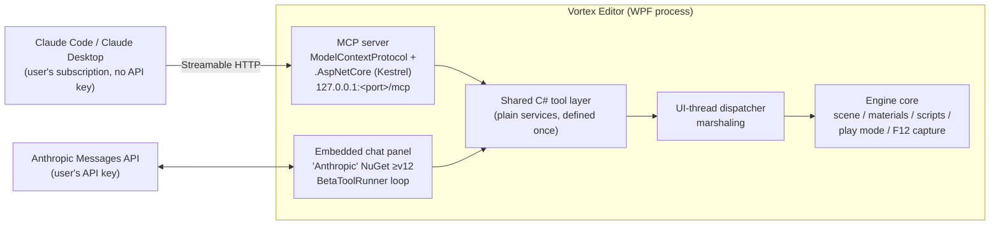

# Design: Claude-Native Engine Integration

Design doc for **[milestone 5 — v3.0.0 Claude-Native Engine](https://github.com/shadow-kernel/Vortex-Engine/milestone/5)**. Goal: Claude can operate the entire editor — build worlds, edit entities/materials/shaders, write scripts, control play mode, and *see* the result. Track work under the [`area:claude` label](https://github.com/shadow-kernel/Vortex-Engine/issues?q=is%3Aissue+label%3Aarea%3Aclaude). The Claude Sound Studio (prompt-driven SFX generation, [milestone 4](https://github.com/shadow-kernel/Vortex-Engine/milestone/4)) is a separate feature that reuses the same Anthropic SDK plumbing.

## Architecture: two halves, one tool layer

Editor operations (create entity, set material, compile scripts, …) are defined **once** as plain C# services. Two consumers sit on top:

- **(A) In-process MCP server** — any MCP client (Claude Code, Claude Desktop, other agents) operates the running editor. **Zero API key**: uses the user's existing Claude Code/Desktop subscription. Build this first.
- **(B) Embedded chat panel** — a dockable Claude chat inside the editor, running a tool-use loop in pure .NET against the same tool layer. Requires the user's Anthropic API key (pay-per-token).



## Half A — In-process MCP server

**Packages:** official `ModelContextProtocol` NuGet (v1.4+, GA since v1.0 Feb 2026, Apache-2.0, maintained by Anthropic's MCP org in collaboration with Microsoft) + `ModelContextProtocol.AspNetCore`.

**Hosting:** self-host Kestrel *inside* the editor process, bound to `127.0.0.1:<port>`, with `.AddMcpServer().WithHttpTransport()` + `MapMcp()` → single **Streamable HTTP** endpoint at `/mcp`. Streamable HTTP, not stdio: the editor is a long-lived GUI process the user already has open — stdio would make the MCP client launch a *second* editor instance. The old HTTP+SSE transport is deprecated; don't use it.

**Tool authoring:** classes marked `[McpServerToolType]`, methods `[McpServerTool]` + `[Description]`. Tool names surface to Claude as `mcp__vortex__<tool>`.

**Threading:** MCP HTTP handlers execute on threadpool threads. Every editor mutation must marshal to the UI/engine thread (Dispatcher / main-loop queue) via a shared marshaling helper — no direct scene access from handler threads.

**Security (per MCP spec DNS-rebinding warning):**
- Bind `127.0.0.1` only — never `0.0.0.0`.
- Validate the `Origin` header.
- Do authorization in ASP.NET Core **middleware, not inside tool methods** — the HTTP handler flushes headers before tool invocation (known v1.0 gotcha).

**Editor UX:** enable/disable toggle + port in settings; status indicator in the status bar; a "Connect Claude Code" menu action that shows/copies the hookup command and can write `.mcp.json` into the project folder.

**Connecting (zero API key):**

```
claude mcp add --transport http vortex http://127.0.0.1:<port>/mcp
```

Claude Desktop connects via its Custom Connectors UI (remote/HTTP servers) — full app restart required after config edits.

## Half B — Embedded chat panel

**Package:** official **`Anthropic`** NuGet (≥v12; v12.32.0 current, .NET 8+/.NET Standard 2.0+). This is the official Anthropic C# SDK — do **not** confuse it with the unofficial community package `Anthropic.SDK` (tghamm).

- Dockable chat panel; streaming responses; model picker (default `claude-opus-4-8`, configurable); API key stored in settings.
- Tool-use loop via `client.Beta.Messages` + **`BetaToolRunner`** (automatic tool-execution loop), whose handlers call the *same* C# tool services directly in-process — no MCP hop, no Node dependency.
- Per-tool permission prompts (ask / allow-always).
- Future option (noted, not planned): Claude Agent SDK sidecar (Node subprocess, no C# version exists) pointed at the editor's own MCP endpoint with `allowedTools: ['mcp__vortex__*']` for the full Claude-Code-grade agent loop.

## Tool-set catalog

Each set is one issue in [milestone 5](https://github.com/shadow-kernel/Vortex-Engine/milestone/5):

| Tool set | Tools (representative) | Notes |
|---|---|---|
| **Scenes & entities** | `list_scenes`, `open_scene`, `save_scene`, `create_entity`, `find_entities(filter)`, `set_transform`, add/remove/configure component (lights, colliders, AudioSource), parent/unparent, `delete`, `scene_outline` | Compact JSON returns; `scene_outline` for orientation |
| **Materials & shaders** | `create_material`, `set_material_props` (PBR fields, textures, blend mode), `assign_material(entity, submesh)`, `write_shader` (.hlsl), `validate_shader` | Rides the existing custom-shader system (path-keyed PSO cache + hot-reload); `validate_shader` returns compile errors so Claude can fix them |
| **Assets & prefabs** | `search_global_library`, `add_asset_to_project(hash)`, `search_store` + `download_store_asset`, `instantiate_prefab`, `create_prefab_from_entity` | Builds on the Global Asset DB ([milestone 3](https://github.com/shadow-kernel/Vortex-Engine/milestone/3)) and Asset Store ([milestone 4](https://github.com/shadow-kernel/Vortex-Engine/milestone/4)) — Claude can pull a door model from Poly Haven and place it |
| **World-building macros** | `place_grid`, `scatter_on_surface` (raycast-based), align/snap, bulk set-property on query results, measure/bounds | Higher-leverage blocks so Claude builds *levels*, not single entities — design case: "build a corridor with flickering lights" |
| **Play mode & vision** | `enter_play_mode`, `exit_play_mode`, `capture_viewport`, `read_console`, `engine_stats` (FPS, draw calls) | `capture_viewport` reuses the **existing F12 native back-buffer capture** (real back-buffer BMP, not GDI) and returns it as MCP image content — the feedback loop that lets Claude verify its own work |
| **Scripts** | `create_script(name, code)`, `read_script`/`edit_script`, `compile_project` (returns errors), `attach_script(entity, script, field values)` | Respects the existing ScriptInspector + hot-reload flow |

## Safety model

- **Undo grouping:** every MCP mutation is grouped into a single undoable operation ("Claude: built corridor" = one Ctrl+Z). Prerequisite: the undo/redo audit in the backlog (every editor operation undoable).
- **Dry-run mode:** a flag that returns planned changes without applying them.
- **Operation log:** an Operations panel logs every tool call with revert buttons.

## Build order

1. MCP server core (Kestrel self-host, transport, marshaling, settings toggle) — P0
2. Scene/entity + material/shader tool sets — P0
3. Embedded chat panel — P0
4. Assets/prefabs, world macros, play-mode/screenshot, scripts tool sets — P1
5. One-command hookup + docs; safety (undo/dry-run/op log) — P1

See also: [[Performance-Master-Plan]] · [[Contributing-Workflow]]
