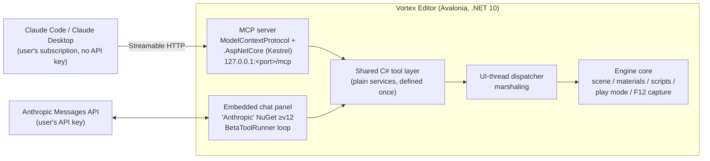

# Design: Claude-Native Engine Integration

Design doc for **[milestone 5 — v3.0.0 Claude-Native Engine](https://github.com/shadow-kernel/Vortex-Engine/milestone/5)**. Goal: Claude can operate the entire editor — build worlds, edit entities/materials/shaders, write scripts, control play mode, and *see* the result. Track work under the [`area:claude` label](https://github.com/shadow-kernel/Vortex-Engine/issues?q=is%3Aissue+label%3Aarea%3Aclaude). The Claude Sound Studio (prompt-driven SFX generation, [milestone 4](https://github.com/shadow-kernel/Vortex-Engine/milestone/4)) is a separate feature — **implemented** (`Managed/Vortex.Core/SoundStudio/`, user guide [[Sound-Studio]]): its `SoundDesigner` talks to the Messages API over plain HTTP (streamed SSE, tool-use loop with a `generate_sound` tool, the user's own key) — the same tool-layer pattern the MCP server will reuse, without an SDK dependency in the shared core.

> **Status (v3.0 work):** Half A is implemented in the cross-platform (Avalonia, .NET 10) editor —
> `Managed/Vortex.Editor/Claude/`: the MCP server, scene/entity tools, viewport capture, play mode, console, undo,
> the Connect dialog and the docs ([[Claude-Integration]], [[Claude-Tools]]). The WPF editor (.NET Framework 4.8)
> cannot host ASP.NET Core in-process and gets no server; it is retired by the Avalonia editor on Windows (#183).

## Architecture: two halves, one tool layer

Editor operations (create entity, set material, compile scripts, …) are defined **once** as plain C# services. Two consumers sit on top:

- **(A) In-process MCP server** — any MCP client (Claude Code, Claude Desktop, other agents) operates the running editor. **Zero API key**: uses the user's existing Claude Code/Desktop subscription. Build this first.
- **(B) Embedded chat panel** — a dockable Claude chat inside the editor, running a tool-use loop in pure .NET against the same tool layer. Requires the user's Anthropic API key (pay-per-token).


```mermaid
flowchart LR
    subgraph Editor["Vortex Editor (Avalonia, .NET 10)"]
        TOOLS["Shared C# tool layer\n(plain services, defined once)"]
        MCP["MCP server\nModelContextProtocol +\n.AspNetCore (Kestrel)\n127.0.0.1:&lt;port&gt;/mcp"]
        PANEL["Embedded chat panel\n'Anthropic' NuGet ≥v12\nBetaToolRunner loop"]
        DISP["UI-thread dispatcher\nmarshaling"]
        ENGINE["Engine core\nscene / materials / scripts /\nplay mode / F12 capture"]
        MCP --> TOOLS
        PANEL --> TOOLS
        TOOLS --> DISP --> ENGINE
    end
    CC["Claude Code / Claude Desktop\n(user's subscription, no API key)"] -- "Streamable HTTP" --> MCP
    API["Anthropic Messages API\n(user's API key)"] <--> PANEL
```

## Half A — In-process MCP server

**Packages:** official `ModelContextProtocol.AspNetCore` 2.2.0 (Apache-2.0, the MCP org's C# SDK, maintained with Microsoft); it brings `ModelContextProtocol` / `.Core` and the `Microsoft.AspNetCore.App` framework reference, which the self-contained app publish bundles.

**Hosting:** self-host Kestrel *inside* the editor process, bound to `127.0.0.1:<port>`, with `.AddMcpServer().WithHttpTransport()` + `MapMcp()` → single **Streamable HTTP** endpoint at `/mcp`. Streamable HTTP, not stdio: the editor is a long-lived GUI process the user already has open — stdio would make the MCP client launch a *second* editor instance. The old HTTP+SSE transport is deprecated; don't use it.

**Tool authoring (implemented):** static methods in classes marked `[McpServerToolType]`, each with `[McpServerTool]` + `[Description]` (parameters too). `ToolCatalog` discovers them once and builds the JSON schemas with `AIFunctionFactory`; the server registers **no** SDK tool objects but a `tools/list` + `tools/call` handler pair over that catalog, so the embedded panel can hand the very same definitions to the Messages API. Tool names surface to Claude as `mcp__vortex__<tool>`; results are compact snake_case JSON, images are `ImageContentBlock`s.

**Dispatch (`ToolHost`, implemented):** HTTP handlers run on thread-pool threads; every call is queued (one at a time — parallel calls would interleave undo steps) and runs on the Avalonia UI thread, inside an `UndoRedoManager` **group**: the whole call becomes one undo step named `Claude: …`, and a call that fails half-way is rolled back (`EndGroup(commit: false)`). Expected failures (`ToolError`, binding errors) return as `isError` results whose text lists valid values. Every call lands in the `OperationLog`.

**Transport:** stateless Streamable HTTP (`HttpServerTransportOptions.Stateless`) — no sessions to lose when the editor restarts, nothing to resume.

**Security (per MCP spec DNS-rebinding warning):**
- Bind `127.0.0.1` only — never `0.0.0.0`.
- Validate the `Origin` header (any non-localhost Origin → 403) **and** the `Host` header (anything but `127.0.0.1` / `localhost` / `::1` → 403: a DNS-rebound name pointing at 127.0.0.1).
- Do authorization in ASP.NET Core **middleware, not inside tool methods** — the HTTP handler flushes headers before tool invocation (known v1.0 gotcha).

**Editor UX:** enable/disable toggle + port in settings; status indicator in the status bar; a "Connect Claude Code" menu action that shows/copies the hookup command and can write `.mcp.json` into the project folder.

**Connecting (zero API key):**

```
claude mcp add --transport http vortex http://127.0.0.1:<port>/mcp
```

Claude Desktop's custom connectors are brokered through Anthropic's cloud and cannot reach `127.0.0.1`; it connects through a local stdio bridge in `claude_desktop_config.json` (`npx -y mcp-remote http://127.0.0.1:<port>/mcp`) — full app restart required after config edits (see [[Claude-Integration]]).

## Half B — Embedded chat panel

**Package:** official **`Anthropic`** NuGet (≥v12; v12.32.0 current, .NET 8+/.NET Standard 2.0+). This is the official Anthropic C# SDK — do **not** confuse it with the unofficial community package `Anthropic.SDK` (tghamm).

- Dockable chat panel; streaming responses; model picker (default `claude-opus-4-8`, configurable); API key stored in settings.
- Tool-use loop via `client.Beta.Messages` + **`BetaToolRunner`** (automatic tool-execution loop), whose handlers call the *same* C# tool services directly in-process — no MCP hop, no Node dependency.
- Per-tool permission prompts (ask / allow-always).
- Future option (noted, not planned): Claude Agent SDK sidecar (Node subprocess, no C# version exists) pointed at the editor's own MCP endpoint with `allowedTools: ['mcp__vortex__*']` for the full Claude-Code-grade agent loop.

## Tool-set catalog

Each set is one issue in [milestone 5](https://github.com/shadow-kernel/Vortex-Engine/milestone/5):

| Tool set | Tools (representative) | Notes |
|---|---|---|
| **Scenes & entities** | `list_scenes`, `open_scene`, `save_scene`, `create_entity`, `find_entities(filter)`, `set_transform`, add/remove/configure component (lights, colliders, AudioSource), parent/unparent, `delete`, `scene_outline` | Compact JSON returns; `scene_outline` for orientation |
| **Materials & shaders** | `create_material`, `set_material_props` (PBR fields, textures, blend mode), `assign_material(entity, submesh)`, `write_shader` (.hlsl), `validate_shader` | Rides the existing custom-shader system (path-keyed PSO cache + hot-reload); `validate_shader` returns compile errors so Claude can fix them |
| **Assets & prefabs** | `search_global_library`, `add_asset_to_project(hash)`, `search_store` + `download_store_asset`, `instantiate_prefab`, `create_prefab_from_entity` | Builds on the Global Asset DB ([milestone 3](https://github.com/shadow-kernel/Vortex-Engine/milestone/3)) and Asset Store ([milestone 4](https://github.com/shadow-kernel/Vortex-Engine/milestone/4)) — Claude can pull a door model from Poly Haven and place it |
| **World-building macros** | `place_grid`, `scatter_on_surface` (raycast-based), align/snap, bulk set-property on query results, measure/bounds | Higher-leverage blocks so Claude builds *levels*, not single entities — design case: "build a corridor with flickering lights" |
| **Play mode & vision** | `enter_play_mode`, `exit_play_mode`, `capture_viewport`, `focus_camera`, `read_console`, `engine_stats` (FPS, draw calls) | `capture_viewport` reuses the **native back-buffer capture** (`CaptureFrame`, a BMP of the next presented frame), hides the editor overlays for that frame and returns a ≤ 1280 px JPEG as MCP image content — the feedback loop that lets Claude verify its own work |
| **Scripts** | `create_script(name, code)`, `read_script`/`edit_script`, `compile_project` (returns errors), `attach_script(entity, script, field values)` | Respects the existing ScriptInspector + hot-reload flow |

## Safety model

- **Undo grouping (implemented):** every mutating call is one undoable operation ("Claude: create Lamp 3" = one Ctrl+Z), via `UndoRedoManager.BeginGroup/EndGroup`; failed calls roll back. The undo depth is 300 steps. Tools record their own undo commands (the Avalonia inspector's direct property edits are not undoable yet — the tools never rely on them).
- **Dry-run mode:** a flag that returns planned changes without applying them.
- **Operation log:** an Operations panel logs every tool call with revert buttons.

## Build order

1. MCP server core (Kestrel self-host, transport, marshaling, settings toggle) — P0
2. Scene/entity + material/shader tool sets — P0
3. Embedded chat panel — P0
4. Assets/prefabs, world macros, play-mode/screenshot, scripts tool sets — P1
5. One-command hookup + docs; safety (undo/dry-run/op log) — P1

See also: [[Performance-Master-Plan]] · [[Contributing-Workflow]]
