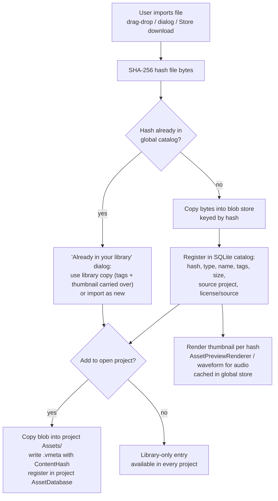

# Design: Global Asset Database

**Status:** Design / planned for [v2.8.0 – Global Asset Database](https://github.com/shadow-kernel/Vortex-Engine/milestone/3)
**Related:** [[Design-Asset-Store-Integrations]] (v2.9.0 store providers feed this database)
**Issues:** [`area:asset-store`](https://github.com/shadow-kernel/Vortex-Engine/issues?q=is%3Aissue+label%3Aarea%3Aasset-store) · [`area:assets`](https://github.com/shadow-kernel/Vortex-Engine/issues?q=is%3Aissue+label%3Aarea%3Aassets)

## Goals

1. **PC-wide library** — every asset ever imported into *any* Vortex project is registered in one machine-wide database. Import a door model once, reuse it in every project from a Library tab.
2. **SHA-256 content addressing** — assets are identified by the hash of their bytes, not by path or timestamp. Verified gap: today `AssetMetadata` has **no content hash at all** — only `LastModified` + `FileSize`.
3. **Zero duplicates** — adding a file whose hash already exists in the store is a no-op. The import dialog detects "already in your library" *before* copying anything.
4. **Sounds are first-class citizens** — audio assets (arriving with the v2.6.0 audio engine, [milestone 1](https://github.com/shadow-kernel/Vortex-Engine/milestone/1)) get waveform thumbnails and click-to-audition directly in the Library tab, same as models get 3D previews.

## Current State (verified in code)

| Aspect | Today | File |
|---|---|---|
| Scope | **Per-project only.** `AssetDatabase` scans `<ProjectRoot>/Assets/` recursively; no AppData/shared library, no cross-project sharing. | `Editor/Core/Assets/AssetDatabase.cs` |
| Identity | `.vmeta` JSON sidecar per asset with a stable **GUID** (`Guid.NewGuid`, survives move/rename) + Type, RelativePath, FileName, ImportDate, LastModified, FileSize, Dependencies (GUID list), ImportSettings, Tags | `Editor/Core/Assets/AssetMetadata.cs` |
| Content hash | **Missing.** No MD5/SHA/fingerprint field; change detection = `.vmeta` timestamp only | — |
| Tags | `AssetTagService.Instance` per-GUID, per-project | `Editor/Core/Assets/AssetTagService.cs` |
| Thumbnails | `AssetPreviewRenderer` — offscreen D3D12 render-to-bitmap (mesh/material spheres, studio lighting, cached RT) | `Editor/Core/Services/Rendering/AssetPreviewRenderer.cs` |
| Browser UI | `AssetBrowserView` with **radio-button tabs**: Explorer, Meshes, Models, Textures, Materials, Scripts; search box, breadcrumb, drag-drop | `Editor/Editors/WorldEditor/Components/AssetBrowser/AssetBrowserView.xaml(.cs)` |
| Import UI | `AssetImportDialog` — name, target folder, tag pills, copy-to-project / generate-meta / auto-detect-textures options | `Editor/Dialogs/AssetImportDialog.cs` |
| Audio type | `DetermineAssetType()` already maps `.wav`/`.mp3` → `AssetType.Audio` | `Editor/Core/Assets/AssetType.cs`, `AssetDatabase.cs` |

## Proposed Architecture

Two pieces under `%LOCALAPPDATA%/VortexEngine/AssetDB`:

1. **SQLite catalog** — tables for assets (hash, type, name, size, import date, source project), tags, sources (which store provider / project the asset came from), licenses (license, author, source URL — required by the store integrations, see [[Design-Asset-Store-Integrations]]), and project references. Concurrency-safe so multiple editor instances can write.
2. **Content-addressed blob store** — a folder keyed by SHA-256. Store-once: adding a blob whose hash already exists is a no-op (dedup by construction). Includes an integrity-verify command (re-hash blobs against their keys).

Pulling an asset into a project **copies** the blob (never links), so projects stay fully self-contained — consistent with the existing `.vpak` shipping model.

### Import flow

### Component plan (mapped to v2.8.0 issues)

- **`ContentHash` on `AssetMetadata`** — SHA-256 computed on every import and reimport; menu/CLI backfill tool for existing projects.
- **`GlobalAssetDatabase` service** (`Editor/Core`) — upserts every project import into the catalog automatically.
- **Blob store** — store-once semantics + integrity verify.
- **Duplicate-aware import dialog** — the anti-duplicate UX: hash check against the global DB happens *first*.
- **Global thumbnail cache** — thumbnails rendered per hash (reuses `AssetPreviewRenderer`); audio gets waveform images.
- **Library maintenance** — size dashboard, remove-from-library with blob GC when unreferenced, export subset as .zip to share between PCs (respecting non-redistributable flags from store providers), import such a bundle.
- **DB settings** — move DB to another drive, blob-store size cap, per-type auto-registration exclusion rules.

## Library Tab UX

A new **Library** radio-tab in `AssetBrowserView`, next to the existing Explorer / Meshes / Models / Textures / Materials / Scripts pills (same pattern, no new panel type):

- Thumbnail grid over the **global** catalog instead of the project folder.
- Search + type filter + tag filter; **source badge** on each tile showing where the asset came from (which store provider or project).
- **"Add to Project"** button + context menu: copies the blob into project `Assets/`, writes a `.vmeta` carrying the same hash, registers in the project `AssetDatabase`, thumbnail carried over. Drag & drop from Library into the Explorer tab or straight into the viewport also works (existing `IDataObject` drag path).
- **Audio entries**: waveform thumbnail + click-to-audition in place (no project import needed to listen).
- Tagging v2: global tags, multi-select bulk tagging, tag rename/merge, saved searches (extends the per-project `AssetTagService`).

## Migration Plan for Existing Projects

1. **Hash backfill** — a one-shot pass (menu action / CLI) that walks a project's `Assets/`, computes SHA-256 for every asset, and writes `ContentHash` into each existing `.vmeta`. GUIDs are untouched — nothing that references assets by GUID changes.
2. **Index existing projects** — one-click scan tool that walks all known projects (the project browser already tracks them), hashes their assets, and registers everything into the global DB. Result: existing BR/horror projects fill the library on day one, with duplicates across projects collapsing into single blobs automatically.
3. No project-side format break: `.vmeta` gains one field; per-project `AssetDatabase` behavior is unchanged when the global DB is disabled.

## Open Questions

- **Dedup granularity** — hash whole files only, or also hash extracted sub-assets (e.g. textures inside a downloaded PBR zip) so partial overlaps dedup too?
- **`.vmeta` ↔ catalog linkage** — is `ContentHash` alone the link, or should the global catalog also track the project GUIDs that reference each blob (enables "used by N projects" and safe blob GC)?
- **Eviction policy** — what happens at the size cap: LRU blob eviction, warn-only, or refuse new registrations? (Settings issue leaves this open.)
- **Modified copies** — when a project edits its copy of a library asset, the hashes diverge. Auto-register the new version, prompt, or ignore?
- **Non-file assets** — materials (`.vmat`) and prefabs (`.ventity`) reference other assets by path/GUID; storing them as blobs needs a dependency-rewrite step on "Add to Project". Scope for v2.8.0 or defer to file-type whitelist?
- **Schema details** — final SQLite schema, WAL mode vs. file locking for multi-instance safety. These are the deliverable of the `needs-design` issue "design doc — global DB schema + content-addressed blob store" ([`needs-design`](https://github.com/shadow-kernel/Vortex-Engine/issues?q=is%3Aissue+label%3Aneeds-design)).
