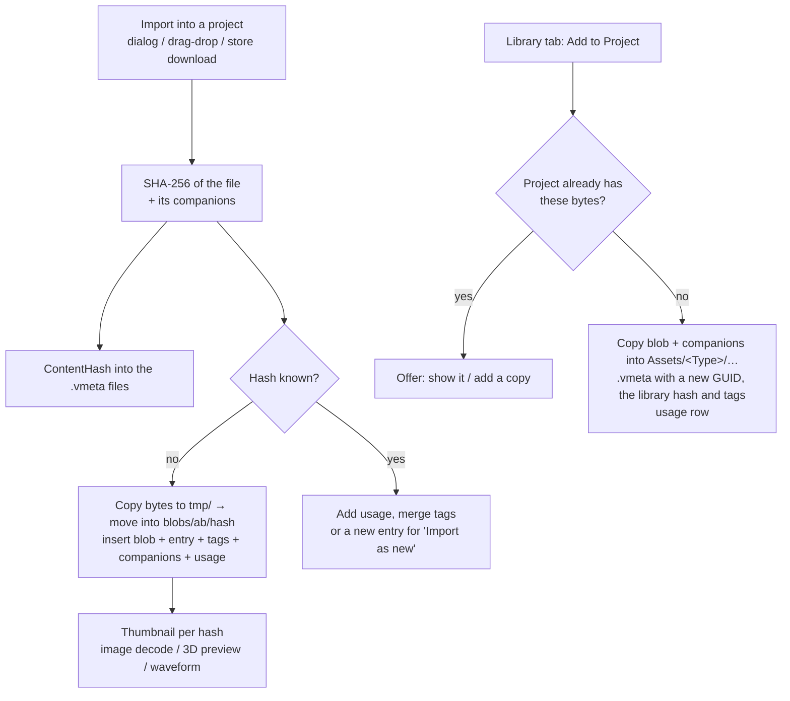

# Design: Global Asset Database

**Status:** Implemented in [v2.9.0 – Global Asset Database](https://github.com/shadow-kernel/Vortex-Engine/milestone/3) (the milestone was called v2.8.0 before the v2.8.0 tag became the Windows/macOS/Linux release).
**Related:** [[Asset-Library]] (user guide) · [[Design-Asset-Store-Integrations]] (v2.10.0 store providers feed this database)
**Code:** `Editor/Core/Assets/Library/` (shared core, both editors) · `Managed/Vortex.Editor/Panels/AssetBrowser/LibraryView.cs`, `Managed/Vortex.Editor/Shell/Library/` (Avalonia UI) · tests in `Managed/Vortex.Core.Tests/LibraryTests.cs`

## Goals

1. **PC-wide library** — every asset imported into *any* Vortex project is registered in one machine-wide database and can be added to any other project from the Library tab.
2. **SHA-256 content addressing** — an asset is identified by the hash of its bytes, not by path or timestamp.
3. **Zero duplicates** — the same bytes are stored once, however many projects or names use them. The import dialog says "already in your library" before anything is copied.
4. **Sounds are first-class** — audio entries get waveform thumbnails, duration/rate metadata and click-to-audition straight from the library.

## Decisions

| Question | Decision |
|---|---|
| Catalog storage | **SQLite** (`catalog.db`, WAL journal, `synchronous=NORMAL`, `foreign_keys=ON`). Bound through a ~300-line binding (`Sqlite.cs`) to the SQLite the OS ships — `winsqlite3.dll` (Windows 10/11), `/usr/lib/libsqlite3.dylib` (macOS), `libsqlite3.so.0` (Linux) — so neither editor needs a NuGet package or a bundled native binary. `VORTEX_SQLITE_LIB` overrides the library. No UPSERT syntax is used (older `winsqlite3` builds predate it). |
| Multi-instance safety | WAL + `busy_timeout` 10 s; every write runs in `BEGIN IMMEDIATE` (writers serialise instead of failing halfway). Blob files are written to `tmp/` outside the lock and moved into place inside the write transaction, so a concurrent garbage collection can never delete a blob that is being registered. Tested with two connections × four writer threads. |
| Location | `%LOCALAPPDATA%\VortexEngine\AssetDB` (Windows), `~/Library/Application Support/VortexEngine/AssetDB` (macOS), `~/.local/share/VortexEngine/AssetDB` (Linux). `VORTEX_APPDATA_DIR` (tests, CI) puts it inside that folder; `VORTEX_ASSETDB_DIR` overrides it completely. A moved library is remembered in `asset-library.json` next to the editor state — outside the library (bootstrap problem). |
| Blob layout | `blobs/ab/abcdef…` (first two hex digits shard the folder), no extension — the original file name and extension live in the catalog. Thumbnails `thumbs/ab/<hash>.png` (256 px). Temporary files in `tmp/` (cleaned after 6 h). |
| `.vmeta` linkage | `AssetMetadata` gains `ContentHash` + `ContentHashFileSize` + `ContentHashFileTime` (the file stamp the hash was computed from: a rename/move keeps it, an edit makes it stale). All three are omitted while unset, so old `.vmeta` files load unchanged and nothing churns in git. The catalog's `usages` table records which project file uses which hash (enables "used in N projects"). |
| Dedup granularity | Whole files. A model additionally keeps its **companions** — the files it needs next to it — each stored as its own blob: a model in its own folder (the import pipeline's `<target>/<name>/` layout, or the only model in its folder) takes the folder (buffers, textures, `materials/*.vmat`, `animations/*.vanim`); otherwise the files it references (glTF `buffers[].uri` / `images[].uri`, OBJ `mtllib` + map files). Companions are not registered as separate entries. |
| Entries vs. blobs | One **blob** per hash; one or more **entries** (name, type, tags, source, license) per blob. Registering known bytes again adds a usage and merges tags into the existing entry; "Import as new" creates a second entry for the same blob — never a second copy. |
| Copy vs. link into projects | **Copy.** Projects stay self-contained and shippable; deleting a project never touches the library and deleting a library entry never touches a project. |
| Size cap | **Warn only.** Over the cap, registrations continue and the user is pointed to Maintenance; the library never evicts on its own. |
| Edited copies | A project file edited after it came from the library simply has a new hash; the next import / index registers it as new content. The library never replaces or deletes an entry because a project copy changed. |
| Materials / prefabs | Stored like any file. Their references to other assets are not rewritten on "Add to Project" — models are the case that needs their files, and companions cover it. |
| What gets registered | Every import (both editors' import dialogs; background queue, never blocks or fails the import), explicit "Add Files to Library" (any type), the project indexer and bundle imports. Type rules (default: no scripts, scenes, folders or unknown files) and the auto-registration switch apply to automatic registration only. |
| Editors | The core (catalog, blobs, hashing, add-to-project, indexer, bundles, maintenance) is framework-free and compiles in both editors (.NET Framework 4.8 / C# 9 for the WPF editor, .NET 10 for Vortex.Core). The Windows WPF editor registers imports; the Library UI is the Avalonia editor's, which becomes the Windows editor with #183. |

## Schema (v1)

```sql
blobs(hash TEXT PRIMARY KEY, size INTEGER, ext TEXT, stored INTEGER, added INTEGER, verified INTEGER)
assets(id INTEGER PRIMARY KEY, hash REFERENCES blobs, name, file_name, type INTEGER, added, updated,
       source_kind,            -- project | manual | store | generated | bundle
       source_name, source_url, author, license, redistributable INTEGER,
       duration REAL, channels, sample_rate, width, height, notes)
tags(asset_id REFERENCES assets ON DELETE CASCADE, tag COLLATE NOCASE, PRIMARY KEY(asset_id, tag))
companions(asset_id REFERENCES assets ON DELETE CASCADE, rel_path, hash REFERENCES blobs, PRIMARY KEY(asset_id, rel_path))
usages(hash, project COLLATE NOCASE, project_name, rel_path COLLATE NOCASE, guid, seen, PRIMARY KEY(hash, project, rel_path))
filters(name PRIMARY KEY COLLATE NOCASE, search, types, tags, created)   -- saved filters
info(key PRIMARY KEY, value)                                             -- schema = 1
```

Times are Unix milliseconds (UTC). The license/author/source URL/redistributable columns are what the v2.10 store providers and the attribution manager fill.

## Flows


```mermaid
flowchart TD
    A[Import into a project<br/>dialog / drag-drop / store download] --> B[SHA-256 of the file<br/>+ its companions]
    B --> W[ContentHash into the .vmeta files]
    B --> C{Hash known?}
    C -- no --> E[Copy bytes to tmp/ → move into blobs/ab/hash<br/>insert blob + entry + tags + companions + usage]
    C -- yes --> D[Add usage, merge tags<br/>or a new entry for 'Import as new']
    E --> T[Thumbnail per hash<br/>image decode / 3D preview / waveform]
    L[Library tab: Add to Project] --> P{Project already has<br/>these bytes?}
    P -- yes --> R[Offer: show it / add a copy]
    P -- no --> Q[Copy blob + companions into Assets/&lt;Type&gt;/…<br/>.vmeta with a new GUID, the library hash and tags<br/>usage row]
```

- **Duplicate-aware import (#57):** the import dialog hashes the incoming files in the background as it opens. A single known file shows an "Already in your library" banner (thumbnail, name, tags, source) with *Use the library entry* (adopts name + tags) or *Import as new*; with several files each known one gets an "import as new" switch.
- **Add to Project (#59):** button, double-click, context menu ("Add to Project", "…in Folder…", "Add to Scene") or a drag from a tile. Drop targets speak project paths, so a drag first adds the asset (or reuses the project's existing copy) and then drags that file — the viewport, inspector slots and folders all work unchanged. Name clashes get the import pipeline's `_1` suffix; a model is rebuilt in its own folder with its companions.
- **Index existing projects (#64):** walks the Project Hub's projects (plus any folder), registers every asset once, collapses duplicates across projects into one entry with several usages, carries `.vmeta` tags over and writes `ContentHash` into existing `.vmeta` files only. Cancellable and idempotent.
- **Backfill (#54):** "Backfill Content Hashes (Project)" hashes every asset of the open project into its `.vmeta`; fresh hashes are kept.

## Maintenance (#63)

- **Stats:** entries, stored bytes vs. cap, blobs, thumbnails, tags, projects; by type, by source, largest assets.
- **Delete:** removes entries; blobs, their thumbnails and companions go once nothing references them (garbage collection runs inside the write lock).
- **Verify:** re-hashes every stored blob and lists missing and damaged files (with the entries they belong to).
- **Find Problems / Fix:** dry run first — blob files without a catalog row, rows without files, unreferenced blobs, stale thumbnails, entries whose bytes are gone; Fix deletes strays, marks missing blobs as not stored and collects garbage. Entries without bytes stay for the user to delete or restore by re-importing the original.
- **Bundles (`.vlib.zip`):** `manifest.json` + `blobs/<hash>` + `thumbs/<hash>.png`. Importing dedupes by hash; non-redistributable entries are never exported (and reported).
- **Move library:** copies catalog, blobs and thumbnails to an empty folder, verifies every blob's hash at the destination, switches the setting, then deletes the old copy. An interrupted move either stays on the old root or is finished on the next start.

## Testing

`dotnet run --project Managed/Vortex.Core.Tests` covers hashing vectors, `.vmeta` round trips (including legacy files), dedup, type rules, search/filter/sort/paging, tag management, saved filters, model companions + Add to Project, garbage collection, verify + orphan repair, bundle export/import, concurrent writers, moving the library, the project indexer and the import hook. The editor smoke check `VORTEX_SMOKE_ONLY=library` drives the Library tab, thumbnails, Add to Project and the import banner end to end.
