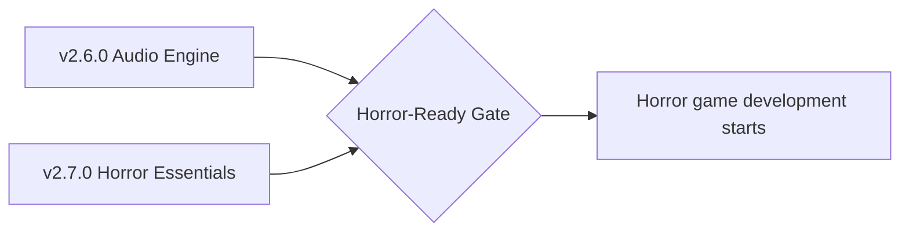

# Horror Game Readiness

**The gate:** first-person horror game development officially starts when milestones **[v2.6.0 – Audio Engine](https://github.com/shadow-kernel/Vortex-Engine/milestone/1)** and **[v2.7.0 – Horror Essentials](https://github.com/shadow-kernel/Vortex-Engine/milestone/2)** are complete. The v2.7.0 epic *"Horror-Ready Gate"* is the umbrella issue — when it closes, we build the game, not the engine.

Every blocker below carries the [`horror-blocker`](https://github.com/shadow-kernel/Vortex-Engine/issues?q=is%3Aissue+label%3Ahorror-blocker) label. Per project philosophy, gameplay (health, flashlight battery, doors, scares) lives in **project scripts** (`VortexBehaviour`), never in the C++ engine — the gate is about engine *capabilities*, not game code.

## The checklist

| # | Blocker | Milestone | Why horror needs it | Current state (verified) |
|---|---------|-----------|---------------------|--------------------------|
| 1 | **Audio backbone** (miniaudio core: device, decoders, voices, wiring AudioSource/AudioListener to real playback) | [v2.6.0](https://github.com/shadow-kernel/Vortex-Engine/milestone/1) | Horror is 50% sound — ambience loops, stingers, creaks. Silence breaks everything else. | `AudioSystem.h/.cpp` is a stub (init sets flags, `update_audio` is a TODO); `ResourceManager::load_audio` returns a generic resource; no decoder, no WASAPI device. The **editor components are complete** (clip, volume, pitch, loop, spatial blend, rolloff, priority — serialized + inspector) but nothing plays. |
| 2 | **3D spatialization v1** (distance attenuation, panning, doppler) | [v2.6.0](https://github.com/shadow-kernel/Vortex-Engine/milestone/1) | "Something is behind you" only works if the player can hear *where*. Positional cues are the core sneak/dread mechanic. | No spatial audio engine exists; the spatial properties (min/max distance, rolloff mode, doppler, spread) sit unused on the editor component. HRTF is deliberately deferred to Steam Audio (v2). |
| 3 | **Vortex.Audio scripting API** (`PlayOneShot`, source Play/Stop/Pause, crossfade) | [v2.6.0](https://github.com/shadow-kernel/Vortex-Engine/milestone/1) | Scares are scripted: play a stinger on trigger, crossfade chase music. Gameplay stays in scripts, so scripts must drive sound. | No audio API in `VortexScriptApi.cs` — scripts cannot play any sound today. |
| 4 | **3D audio gizmos in viewport** (range spheres + speaker icons + live audition) | [v2.6.0](https://github.com/shadow-kernel/Vortex-Engine/milestone/1) | Sound placement is level design in horror; designers must *see* (and hear) attenuation ranges while placing sources. | No spatial-audio placement preview in the viewport. The always-on-top gizmo pass (depth-disabled PSO) already exists to build on. |
| 5 | **Spot light shadow mapping — the flashlight** | [v2.7.0](https://github.com/shadow-kernel/Vortex-Engine/milestone/2) | THE horror feature: a flashlight beam that casts moving shadows. No shadows = no darkness that means anything. | No shadow maps, shadow depth passes, or shadow sampling anywhere in the renderer. Full PBR lights exist (16 point / 8 spot per frame) but **cast no shadows**. |
| 6 | **Runtime light control API (Vortex.Light) + flicker helper** | [v2.7.0](https://github.com/shadow-kernel/Vortex-Engine/milestone/2) | Flashlight follows the player; bulbs flicker; light switches are gameplay. | Scripts can only set ambient + the directional light (`Lighting.SetAmbient/SetDirectional`). Point/Spot light *components* exist but scripts cannot drive their intensity/color/range/enabled per frame. |
| 7 | **Depth fog (linear/exp/exp2) + height fog** | [v2.7.0](https://github.com/shadow-kernel/Vortex-Engine/milestone/2) | Fog limits sight lines and sells dread — the cheapest atmosphere multiplier there is. | No fog of any kind in the shaders — no per-pixel fog depth or inscattering. (Volumetric fog is a separate v3.3 issue.) |
| 8 | **Post-processing framework** (ordered fullscreen pass chain) | [v2.7.0](https://github.com/shadow-kernel/Vortex-Engine/milestone/2) | Every screen-space horror effect (vignette, grain, grading) needs a place to run, between scene and UI, without breaking DLSS/render-scale. | Only the render-scale composite pass exists (`upscale.hlsl`, bilinear); ACES tonemapping lives in the base shader. No pass chain, no ping-pong RTs. |
| 9 | **Post FX pack 1 — vignette, film grain, chromatic aberration** | [v2.7.0](https://github.com/shadow-kernel/Vortex-Engine/milestone/2) | The tension package: grain ramps up as the monster nears, vignette closes in — scriptable fear feedback. | None of these effects exist; blocked on #8. |
| 10 | **Transparency pipeline** (alpha blending + sorted transparent pass) | [v2.7.0](https://github.com/shadow-kernel/Vortex-Engine/milestone/2) | Glass, ghosts, dust, dirty windows. Semi-transparency is a horror staple. | Verified gap: **every PSO has `BlendEnable = FALSE`**. `.vmat` blend modes (AlphaBlend/Additive) are parsed but everything renders opaque. |
| 11 | **Trigger volumes + OnTrigger events** | [v2.7.0](https://github.com/shadow-kernel/Vortex-Engine/milestone/2) | Jump scares, door zones, checkpoints — "player entered the room" is the fundamental horror primitive. | Character-vs-trigger events already fire (`CollisionService.StepEvents` → `OnTriggerEnter/Stay/Exit` with `TriggerHit` EntityId/Name/Tag). The milestone issue extends overlap detection to dynamic bodies. |
| 12 | **Physics.Raycast for game scripts** | [v2.7.0](https://github.com/shadow-kernel/Vortex-Engine/milestone/2) | Line-of-sight checks (can the monster see me?), interaction crosshair, hitscan. | `RaycastService` exists but is **editor-only** (gizmo/entity picking). No `Physics.Raycast` reachable from `VortexBehaviour`. |
| 13 | **Runtime prefab instantiation** (Instantiate/Destroy) | [v2.7.0](https://github.com/shadow-kernel/Vortex-Engine/milestone/2) | Spawning props, pickups, enemies mid-game — scares that materialize. | `PrefabService` instantiates `.ventity` prefabs in the editor only; no script-facing Instantiate/Destroy API. |
| 14 | **Coroutines + timers** (WaitForSeconds, Invoke, InvokeRepeating) | [v2.7.0](https://github.com/shadow-kernel/Vortex-Engine/milestone/2) | Scare sequences are timed choreography: wait 2s, slam the door, kill the lights. | Nothing — no coroutines, no async pattern, no delay/invoke system in the script runtime. |
| 15 | **Save/load system** (save slots + PlayerPrefs-style storage) | [v2.7.0](https://github.com/shadow-kernel/Vortex-Engine/milestone/2) | Checkpoints are core to horror pacing — death must cost something, but not everything. | Nothing exists — no persistent game-data storage of any kind. (`DataSerializer` exists for scenes and is the planned foundation.) |
| 16 | **Scene transitions** (async LoadScene + loading screen hook) | [v2.7.0](https://github.com/shadow-kernel/Vortex-Engine/milestone/2) | Multi-level games: house → basement → outside, with a loading screen instead of a freeze. | `Scene.Load(name)` already works (deferred, safe from `Update`, game-driven); missing async loading with progress callback + VUI loading-screen hook. Per-scene `.vpak` layers already support mount/unmount streaming. |
| 17 | **Animation events** (keyframe callbacks — footsteps!) | [v2.7.0](https://github.com/shadow-kernel/Vortex-Engine/milestone/2) | Footstep sounds synced to walk cycles (pairs with audio random containers); attack-hit timing. | Largely working: `.vanim` event markers (time + name) are authorable in the Keyframe Editor and dispatched to `OnAnimationEvent`. The issue adds the string parameter and rounds out the event track. |
| 18 | **Gamepad + keyboard UI navigation** (focus system) | [v2.7.0](https://github.com/shadow-kernel/Vortex-Engine/milestone/2) | Players on the couch with a controller must navigate menus without a mouse. | VUI is **mouse-only**: no D-pad/stick input in `VuiInput`, no focus-next/prev, no visible focus indicator. Gamepad input itself (sticks, triggers, buttons, DualSense) is fully implemented engine-side. |
| 19 | **Horror Starter template** (FP controller v2, flashlight, interaction, footsteps — all project scripts) | [v2.7.0](https://github.com/shadow-kernel/Vortex-Engine/milestone/2) | The game's foundation and the test bed that proves every v2.6/v2.7 feature end-to-end. | Only the generic `Templates/Default3D` submodule exists, with a solid FP `PlayerController.cs` (WASD/mouse/gamepad, gravity, jump, crouch, sprint). No flashlight, interaction, footsteps, or door/scare examples. |
| 20 | **Bone sockets — entity attachment** ([epic #169](https://github.com/shadow-kernel/Vortex-Engine/issues/169): attach entities to animated bones + runtime Attach/Detach API + socket authoring UI) | [v2.7.0](https://github.com/shadow-kernel/Vortex-Engine/milestone/2) | A character must HOLD things: flashlight in hand, pistol, lantern — glued to the hand through every animation, in editor and shipped builds. | Nothing — `AnimationService` computes bone palettes for GPU skinning only; no system drives a child entity from a bone's world transform. |
| 21 | **First-person viewmodel layer** (own FOV, no wall clipping, DLSS-safe motion vectors) | [v2.7.0](https://github.com/shadow-kernel/Vortex-Engine/milestone/2) | FP horror shows arms + flashlight/weapon in view; rendered naively they clip through walls and distort at world FOV. | Nothing — the render sequence is fixed (scene → mvec → upscale → UI) with no second-projection layer. |
| 22 | **Weapon feel package** (bone-masked animation layers, synced character+weapon clips, camera shake/recoil primitives, pistol template sample) | [v2.7.0](https://github.com/shadow-kernel/Vortex-Engine/milestone/2) | Fire = one animation event → recoil + muzzle flash + light pulse + shell + bang + hitscan, 100% smooth; aim while walking needs upper-body layering. | Nothing — one clip per entity (PlayAnimation/CrossFade), no layers/masks, no synced multi-entity playback, no camera-shake utilities. Full particle smoke/tracers/decals upgrade follows in [v3.3.0 VFX](https://github.com/shadow-kernel/Vortex-Engine/milestone/8). |

## What we deliberately DON'T need for v1

Scope honesty — these are real gaps, but they do **not** block starting the game:

- **NavMesh AI** → waypoint/scripted patrol paths are fine for the first monster. Recast/Detour navmesh, behavior trees, and perception land in [v3.2.0 AI & Navigation](https://github.com/shadow-kernel/Vortex-Engine/milestone/7).
- **Volumetric fog / light shafts** → depth fog (#7) plus spot shadows (#5) carry the atmosphere. Froxel-based volumetrics (the visible flashlight beam) come in [v3.3.0 VFX](https://github.com/shadow-kernel/Vortex-Engine/milestone/8).
- **Jolt physics** → the verified collide-and-slide character controller (solid ground/walls, capsule depenetration, trigger events) is enough for a walking-and-hiding horror game. Rigid-body dynamics, hinge-constraint doors, and ragdolls come in [v3.1.0 Physics v2](https://github.com/shadow-kernel/Vortex-Engine/milestone/6).

## See also

- [[Roadmap]] — all 10 milestones
- [[Engine-Status]] — full per-subsystem gap analysis
