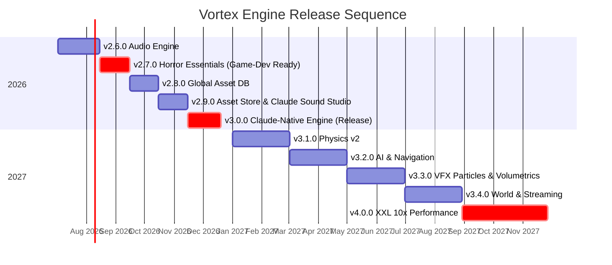

# Roadmap

Vortex Engine's roadmap is **horror-game-first**: every milestone up to v3.0.0 is ordered by what a first-person horror game needs *next*, not by what looks impressive on a feature matrix. Two fixed points define the sequence:

- **"Game-Dev Ready" = end of v2.7.0.** When the [Horror Essentials milestone](https://github.com/shadow-kernel/Vortex-Engine/milestone/2) closes, development of the first horror game officially starts on the engine. Everything in v2.6.0 and v2.7.0 is gated by that goal — audio first (a silent horror game is not a horror game), then shadows, fog, post-FX, triggers, save/load, and a first-person starter template.
- **Long-term target: UE5-class features at 10x performance.** The v3.x line builds out the big systems (physics, AI, VFX, streaming), and v4.0.0 is the GPU-driven renderer rewrite that makes the "10x" claim provable with CI benchmarks.

Issues carrying the `horror-blocker` label are the critical path: [browse all horror-blockers](https://github.com/shadow-kernel/Vortex-Engine/issues?q=is%3Aissue+label%3Ahorror-blocker). Epics per milestone carry [`type:epic`](https://github.com/shadow-kernel/Vortex-Engine/issues?q=is%3Aissue+label%3Atype%3Aepic).

---

## v2.6.0 — Audio Engine ([milestone](https://github.com/shadow-kernel/Vortex-Engine/milestone/1), due Aug 15 2026)

Today the engine has complete AudioSource/AudioListener editor components — but the native `AudioSystem` is a stub and `load_audio` returns nothing. v2.6.0 makes sound real: **miniaudio** (Unlicense/MIT-0, vendorable into an MIT repo) becomes the native backend, with **Steam Audio** (Apache-2.0) planned as the v2 HRTF/occlusion spatializer on top.

Key deliverables:

- Vendor miniaudio + native AudioEngine core — WASAPI device, mixing, WAV/FLAC/MP3/OGG decoding
- Wire the existing AudioSource/AudioListener components to native playback (PlayOnAwake, per-frame position sync)
- 3D spatialization v1: distance attenuation, panning, doppler (HRTF deferred to Steam Audio)
- Voice management: pooling, priority + voice stealing; streaming playback for music & long ambience (incl. from `.vpak`)
- `Vortex.Audio` scripting API for game scripts (PlayOneShot, Play/Stop/Pause, crossfade)
- Mixer core (Master/Music/SFX/Ambience/UI buses, ducking) + **Audio Mixer editor window** with faders and live meters
- Editor tooling: **3D audio gizmos in the viewport** (range spheres, speaker icons), audition in edit mode, audio import with waveform previews
- Horror-flavored extras: reverb zones, random sound containers (footsteps/creaks), fade envelopes
- Ship audio in game export: `.vpak` audio entries + persisted per-bus volume settings

**Unlocks:** the single biggest missing pillar for horror — ambience, footsteps, stingers, 3D-placed sounds — plus the audio foundation that v2.7.0 animation events, v2.9.0 Claude Sound Studio, and v3.2.0 AI hearing perception all build on.

Labels: [`area:audio`](https://github.com/shadow-kernel/Vortex-Engine/issues?q=is%3Aissue+label%3Aarea%3Aaudio)

---

## v2.7.0 — Horror Essentials, the "Game-Dev Ready" gate ([milestone](https://github.com/shadow-kernel/Vortex-Engine/milestone/2), due Sep 15 2026)

The gate milestone. The engine already has full PBR lighting (16 point / 8 spot lights) — but **no light casts a shadow**, all PSOs have blending disabled (transparent materials render opaque), and scripts can't raycast, spawn prefabs, or save the game. v2.7.0 closes exactly those gaps and nothing else.

Key deliverables:

- **Spot light shadow mapping — the flashlight** (shadow atlas + PCF), followed by cascaded directional shadows and cube-map point shadows
- Runtime light control API (`Vortex.Light`) + flicker helper — flashlight follows the player, bulbs flicker, light switches work
- Depth/height fog + a **post-processing framework** (pass chain between scene and UI, preserving the render-scale/DLSS slots) with post FX pack 1: vignette, film grain, chromatic aberration; bloom; color grading (LUT); SSAO
- **Transparency pipeline**: sorted back-to-front transparent pass with blend-enabled PSOs — glass, ghosts, dust
- Gameplay runtime essentials: trigger volumes with `OnTriggerEnter/Exit/Stay`, `Physics.Raycast` for scripts, runtime `Instantiate`/`Destroy`, coroutines + timers, event bus, entity queries/hierarchy traversal
- **Save/load system**: PlayerPrefs-style KV store + snapshot save slots (checkpoints)
- Scene transitions (`LoadScene` with loading-screen hook), `Debug.Log` + dev console + debug draw
- Animation events (keyframe callbacks → footstep sounds sync with walk cycles), gamepad/keyboard menu navigation for VUI
- **Horror Starter template**: FP controller v2, flashlight with battery + flicker, interaction prompts, footsteps, doors, example jump-scare — all as project scripts, per the gameplay-in-scripts philosophy

**Unlocks:** horror game production starts. The starter template doubles as the engine's showcase and the test bed for every v2.6/v2.7 feature.

Labels: [`horror-blocker`](https://github.com/shadow-kernel/Vortex-Engine/issues?q=is%3Aissue+label%3Ahorror-blocker), [`area:rendering`](https://github.com/shadow-kernel/Vortex-Engine/issues?q=is%3Aissue+label%3Aarea%3Arendering), [`area:scripting`](https://github.com/shadow-kernel/Vortex-Engine/issues?q=is%3Aissue+label%3Aarea%3Ascripting)

---

## v2.8.0 — Global Asset Database ([milestone](https://github.com/shadow-kernel/Vortex-Engine/milestone/3), due Oct 15 2026)

Today the AssetDatabase is strictly per-project (GUID `.vmeta` sidecars, no content hash, no cross-project storage). v2.8.0 adds a **machine-wide, content-addressed asset library** in `%LOCALAPPDATA%/VortexEngine`: every import is SHA-256 hashed and registered once, so duplicates become impossible and any asset can be reused in any project.

Key deliverables:

- Design doc: SQLite catalog + content-addressed blob store (store-once, dedupe by SHA-256)
- SHA-256 content hashing on every import (+ backfill tool for existing projects)
- GlobalAssetDatabase service (auto-register every import) + blob store (copy into projects on demand, projects stay self-contained)
- Duplicate-aware import dialog: "already in your library" flow
- **Library tab in the Asset Browser** — thumbnail grid over the global DB with search/type/tag filters — plus one-click "Add to Project" and drag & drop into the project
- Sounds as first-class citizens: waveform thumbnails + click-to-audition in the Library
- Migration scan to index existing projects, global thumbnail cache, tagging v2, maintenance tools (stats, orphan cleanup, export/import bundles)

**Unlocks:** the storage substrate for the v2.9.0 Asset Store (every download lands in the library, hash-matched assets skip re-download) and the asset tools Claude uses in v3.0.0.

Labels: [`area:asset-store`](https://github.com/shadow-kernel/Vortex-Engine/issues?q=is%3Aissue+label%3Aarea%3Aasset-store)

---

## v2.9.0 — Asset Store & Claude Sound Studio ([milestone](https://github.com/shadow-kernel/Vortex-Engine/milestone/4), due Nov 15 2026)

An in-editor **Store tab** for free asset sources, built as three provider tiers behind one `IAssetProvider` abstraction (all verified July 2026): Tier 1 anonymous CC0 (Poly Haven, ambientCG, poly.pizza), Tier 2 per-user API key (Freesound, Sketchfab OAuth), Tier 3 honest no-API flows (Mixamo WebView2 interception, Kenney curated manifest, Sonniss guided download). Everything flows through the global asset DB with hash-dedup. Alongside it: **Claude Sound Studio** — Claude designs SFX prompts and iterates, a sound-generation API (primary: ElevenLabs) renders the audio.

Key deliverables:

- `IAssetProvider` abstraction + Store tab UI (provider tiles, license badges, download queue, attribution display)
- Poly Haven (CC0 models/textures/HDRIs), ambientCG (PBR zips **auto-built into ready `.vmat` materials** — 1 click = usable material), poly.pizza (Quaternius low-poly, many rigged+animated)
- Freesound SFX search with license filter (default CC0/CC-BY) + audition-before-download; Sketchfab (1M+ CC models, glTF via OAuth, architected for the Fab API swap)
- **Mixamo integration**: WebView2 embed with download interception feeding FBX straight into the existing skeletal-animation import
- Unified download pipeline: queue → SHA-256 verify → right importer per type → global DB (dedup) → optional add-to-project
- License & attribution manager + automatic `CREDITS.md` generation at game export
- **Claude Sound Studio**: prompt input + horror presets (stingers, footsteps, door creaks, whispers...), ElevenLabs sound-generation backend, Claude prompt orchestration with iterate-by-chat, Stable Audio / fal.ai backend for music beds, generation recipes stored in `.vmeta` for later remixing

**Unlocks:** a solo dev can fill a horror level with legally-clean models, materials, animations, and AI-generated sound without leaving the editor.

Labels: [`area:asset-store`](https://github.com/shadow-kernel/Vortex-Engine/issues?q=is%3Aissue+label%3Aarea%3Aasset-store), [`area:claude`](https://github.com/shadow-kernel/Vortex-Engine/issues?q=is%3Aissue+label%3Aarea%3Aclaude)

---

## v3.0.0 — Claude-Native Engine (Release) ([milestone](https://github.com/shadow-kernel/Vortex-Engine/milestone/5), due Dec 20 2026)

The headline release: **Claude operates the whole engine.** The editor hosts an in-process MCP server (official `ModelContextProtocol` C# SDK, Streamable HTTP on `127.0.0.1/mcp`) so Claude Code / Claude Desktop can build worlds, edit materials and shaders, write scripts, and control play mode — plus an embedded Claude chat panel (official `Anthropic` NuGet) sharing the **same tool layer**.

Key deliverables:

- In-process MCP server over Streamable HTTP (localhost bind + Origin validation, UI-thread marshaling, settings toggle)
- MCP tool sets: scenes & entities · materials & shaders (incl. write + compile-check `.hlsl`) · assets & prefabs (search library/store, import, instantiate) · **world-building macros** (scatter, grid, bulk edit — "build a corridor with flickering lights") · play mode, **screenshots & logs** (Claude sees and verifies what it builds) · scripts (create/edit/compile/attach VortexBehaviours)
- Embedded Claude panel: streaming chat + tool loop + per-tool permission prompts, pure .NET (no Node dependency)
- One-command hookup for Claude Code/Desktop (`claude mcp add ...`) + docs
- Safety: every Claude mutation is one undo step, dry-run mode, operation log with revert
- Release hardening: full v2.6→v3.0 QA matrix, project migration, code signing (Authenticode), crash reporting, documentation sweep

**Unlocks:** the "Claude-native" identity of the engine — an agent that can build, inspect, and fix a level end-to-end using the audio, rendering, asset-DB, and store systems shipped in v2.6–v2.9.

Labels: [`area:claude`](https://github.com/shadow-kernel/Vortex-Engine/issues?q=is%3Aissue+label%3Aarea%3Aclaude)

---

## v3.1.0 — Physics v2 ([milestone](https://github.com/shadow-kernel/Vortex-Engine/milestone/6), 2027)

Replace the custom collide-and-slide + AABB dynamics with **Jolt Physics** (MIT). Existing Collider components and the Collision Editor stay as authoring; Jolt becomes the simulation.

Key deliverables:

- Vendor Jolt + native bridge (map Box/Sphere/Capsule/Mesh colliders to Jolt bodies, fixed-timestep with interpolation)
- Rigid body dynamics + script API (AddForce/AddImpulse, collision callbacks with contacts)
- Constraints: **hinge (the creaking horror door)**, ball, slider, fixed — with limits, motors, breakability
- Character controller v2 on Jolt (proper stair-stepping, slopes, crouch, pushing props)
- Ragdoll generated from the skeletal rig; physics debug draw + editor sim preview; compound colliders + working physics materials

**Unlocks:** physical doors, throwable props, ragdoll deaths — and a character controller that no longer catches on angled surfaces.

Labels: [`area:physics`](https://github.com/shadow-kernel/Vortex-Engine/issues?q=is%3Aissue+label%3Aarea%3Aphysics)

---

## v3.2.0 — AI & Navigation ([milestone](https://github.com/shadow-kernel/Vortex-Engine/milestone/7), 2027)

The horror monster stack.

Key deliverables:

- NavMesh baking with vendored **Recast/Detour** + editor bake UI and viewport visualization
- NavAgent component + pathfinding API for scripts (SetDestination, local avoidance)
- Behavior tree runtime + visual BT editor (blackboard, script-defined leaf tasks — patrol → investigate → chase → search)
- **Perception: vision cones (raycast LOS) + hearing events** wired to the audio engine — the hide-and-sneak mechanic
- Root motion support (walk cycles actually move the entity), waypoint/patrol tooling, Horror Monster sample as project scripts

**Unlocks:** a monster that patrols, hears your footsteps, sees you, and hunts you through the level.

Labels: [`area:ai`](https://github.com/shadow-kernel/Vortex-Engine/issues?q=is%3Aissue+label%3Aarea%3Aai)

---

## v3.3.0 — VFX: Particles & Volumetrics ([milestone](https://github.com/shadow-kernel/Vortex-Engine/milestone/8), 2027)

The atmosphere toolkit — and the engine's first compute-shader systems.

Key deliverables:

- **GPU particle system core** (compute emit/simulate, instanced billboards, soft-particle depth fade) + Particle Editor window with `.vfx` asset format
- **Volumetric fog + light shafts (froxel-based)** — flashlight beams visible through fog, the single biggest horror atmosphere feature
- Decal system (projected blood/damage/grime with script API), trail & beam renderers, particle collision

**Unlocks:** dust motes in a flashlight cone, dripping pipes, blood on the walls.

Labels: [`area:rendering`](https://github.com/shadow-kernel/Vortex-Engine/issues?q=is%3Aissue+label%3Aarea%3Arendering)

---

## v3.4.0 — World & Streaming ([milestone](https://github.com/shadow-kernel/Vortex-Engine/milestone/9), 2027)

From corridors to open worlds, building on the already-strong instancing tech (63k instances @ 240 FPS with MT cull + LOD).

Key deliverables:

- Terrain system: heightmap sculpting, splat-map texture painting, quadtree LOD, terrain colliders
- Foliage painting feeding the existing GPU instancing + geometric-LOD paths
- Level streaming volumes + async scene chunk loading (per-scene `.vpak` mount/unmount already exists — add async threads + activation fences)
- **HZB occlusion culling** (huge for indoor horror — walls hide everything; today only frustum + distance culling exists)
- Async asset streaming (textures/meshes on demand), spatial partition (octree/BVH), world-partition research spike

**Unlocks:** larger horror worlds without hitching — and the culling/streaming groundwork v4.0.0 requires.

Labels: [`area:core`](https://github.com/shadow-kernel/Vortex-Engine/issues?q=is%3Aissue+label%3Aarea%3Acore)

---

## v4.0.0 — XXL: 10x Performance ([milestone](https://github.com/shadow-kernel/Vortex-Engine/milestone/10), 2027)

The UE5-class GPU-driven renderer rewrite. Baselines exist (1850 FPS simple scenes, 63k instances @ 240 FPS); v4.0.0 defines target scenes and makes the 10x measurable. Sequenced deliberately: **render graph first** — everything else plugs into it.

Key deliverables:

- Render graph / frame graph architecture (declarative passes, transient RT pooling — replaces the hard-coded scene→mvec→upscale→UI sequence)
- Bindless resources (descriptor indexing) → **GPU culling + ExecuteIndirect** (CPU draw submission stops scaling with instance count; ~10x on high-instance scenes) → mesh shader pipeline (meshlets)
- Job system (persistent work-stealing pool replacing per-frame thread spawns) and ECS/data-oriented scene core (design doc + staged migration)
- Frame allocators & memory arenas, async compute queues, virtual texturing / sampler-feedback streaming
- **TAA + temporal history** (there is no AA today outside DLSS), skinned-mesh LOD + per-object motion vectors
- **Benchmark suite in CI** — frame-time JSON per scene, PRs fail on regression: the guardrail that makes "10x" provable

**Unlocks:** UE5-class rendering architecture at the performance level the engine was founded on.

Labels: [`type:perf`](https://github.com/shadow-kernel/Vortex-Engine/issues?q=is%3Aissue+label%3Atype%3Aperf)

---

## Backlog (no milestone)

Themes tracked without a release assignment, pulled forward when priorities demand ([`P3-low`](https://github.com/shadow-kernel/Vortex-Engine/issues?q=is%3Aissue+label%3AP3-low) dominates here):

- **Networking / multiplayer foundations** — research-first epic for the long-term 16-player Battle Royale vision; explicitly post-v4
- **Animation pro tools** — visual state machine & blend trees, IK (foot planting, look-at), skeleton retargeting
- **UI & localization** — rich text/typography v2, string tables + subtitle pipeline, VUI theming/responsive layout
- **Cinematics & media** — sequencer/timeline editor, video playback for cutscenes
- **Shipping** — Steam integration (achievements, cloud saves), nightly builds + beta update channel, automated engine test suite gating PRs
- **Rendering extras** — SSR, HDR display output, DXR ray-traced shadows/AO
- **Editor & assets QoL** — undo/redo audit, plugin system, viewport debug render modes, bulk asset operations, dependency-graph UI, in-game console v2, visual scripting research

---

## Timeline

*Dates through v3.0.0 are milestone due dates; 2027 bars indicate sequence, not committed dates.*
